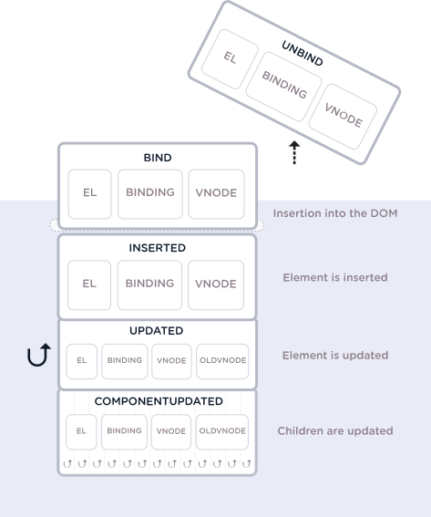

# vuejs-interview-questions
List of 300 VueJS Interview Questions

> Click :star:if you like the project. Pull Requests are highly appreciated. Follow me [@SudheerJonna](https://twitter.com/SudheerJonna) for technical updates.

### Table of Contents
-------------------------------------------------------------------
| No. | Questions |
|---- | ---------
|1  | [What is VueJS](#what-is-vuejs) |
|2  | [What are the major features of VueJS](#what-are-the-major-features-of-vuejs) |
|3  | [What are the lifecycle methods of VueJS](#what-are-the-lifecycle-methods-of-vuejs)|
|4  | [What are the conditional directives](#what-are-the-conditional-directives)|
|5  | [What is the difference between v-show and v-if directives](#what-is-the-difference-between-v-show-and-v-if-directives)|
|6  | [What is the purpose of v-for directive?](#what-is-the-purpose-of-v-for-directive)|
|7  | [What is vue instance?](#what-is-vue-instance)|
|8  | [How do you achieve conditional group of elements?](#how-do-you-achieve-conditional-group-of-elements)|
|9  | [How do you reuse elements with key attribute?](#how-do-you-reuse-elements-with-key-attribute)|
|10 | [Why should not use if and for directives together on the same element?](#why-should-not-use-if-and-for-directives-together-on-the-same-element)|
|11 | [Why do you need to use key attribute on for directive?](#why-do-you-need-to-use-key-attribute-on-for-directive)|
|12 | [What are the array detection mutation methods?](#what-are-the-array-detection-mutation-methods)|
|13 | [What are the array detection non mutation methods?](#what-are-the-array-detection-non-mutation-methods)|
|14 | [What are the caveats of array changes detection?](#what-are-the-caveats-of-array-changes-detection)|
|15 | [What are the caveats of object changes detection?](#what-are-the-caveats-of-object-changes-detection)|
|16 | [How do you use for directive with a range?](#how-do-you-use-for-directive-with-a-range)|
|17 | [How do you use for directive on template?](#how-do-you-use-for-directive-on-template)|
|18 | [How do you use event handlers?](#how-do-you-use-event-handlers)|
|19 | [What are the event modifiers provided by vue?](#what-are-the-event-modifiers-provided-by-vue)|
|20 | [What are key modifiers?](#what-are-key-modifiers)|
|21 | [How do you define custom key modifier aliases?](#how-do-you-define-custom-key-modifier-aliases)|
|22 | [What are the supported System Modifier Keys?](#what-are-the-supported-system-modifier-keys)|
|23 | [What are the supported Mouse Button Modifiers?](#what-are-the-supported-mouse-button-modifiers)|
|24 | [How do you implement two way binding?](#how-do-you-implement-two-way-binding)|
|25 | [What are the supported modifiers on model?](#what-are-the-supported-modifiers-on-model)|
|26 | [What are components and give an example?](#what-are-components-and-give-an-example)|
|27 | [What are props?](#what-are-props)|
|28 | [When component needs a single root element?](#when-component-needs-a-single-root-element)|
|29 | [How do you communicate from child to parent using events?](#how-do-you-communicate-from-child-to-parent-using-events)|
|30 | [How do you implement model on custom input components?](#how-do-you-implement-model-on-custom-input-components)|
|31 | [What are slots?](#what-are-slots)|
|32 | [What is global registration in components?](#what-is-global-registration-in-components)|
|33 | [Why do you need local registration?](#why-do-you-need-local-registration)|
|34 | [What is the difference between local and global registration in module system?](#what-is-the-difference-between-local-and-global-registration-in-module-system)|
|35 | [What are possible prop types?](#what-are-possible-prop-types)|
|36 | [What is the data flow followed by props?](#what-is-the-data-flow-followed-by-props)|
|37 | [What are non prop attributes?](#what-are-non-prop-attributes)|
|38 | [Describe about validations available for props?](#describe-about-validations-available-for-props)|
|39 | [How do you customize model directive for a component?](#how-do-you-customize-model-directive-for-a-component)|
|40 | [What are the possible ways to provide transitions?](#What-are-the-possible-ways-to-provide-transitions)|
|41 | [What is vue router and their features?](#what-is-vue-router-and-their-features)|
|42 | [What are the steps to use vue router and give an example?](#what-are-the-steps-to-use-vue-router-and-give-an-example)|
|43 | [What is dynamic route matching?](#what-is-dynamic-route-matching)|
|44 | [How to make router param changes as reactive?](#how-to-make-router-param-changes-as-reactive)|
|45 | [What is route matching priority?](#what-is-route-matching-priority)|
|46 | [What are nested routes?](#what-are-nested-routes)|
|47 | [What are single file components?](#what-are-single-file-components)|
|48 | [Is Single File Components violating separation of concerns?](#is-single-file-components-violating-separation-of-concerns)|
|49 | [What are the problems solved by Single File Components?](#what-are-the-problems-solved-by-single-file-components)|
|50 | [What are filters?](#what-are-filters)|
|51 | [What are the different ways to create filters?](#what-are-the-different-ways-to-create-filters)|
|52 | [How do you chain filters](#how-do-you-chain-filters)|
|53 | [Is it possible to pass parameters for filters?](#is-it-possible-to-pass-parameters-for-filters)|
|54 | [What are plugins and their various services?](#what-are-plugins-and-their-various-services)|
|55 | [ How to create a plugin?](#how-to-create-a-plugin)|
|56 | [How to use a plugin?](#how-to-use-a-plugin)|
|57 | [What are mixins?](#what-are-mixins)|
|58 | [What are global mixins?](#what-are-global-mixins)|
|59 | [How do you use mixins in CLI?](#how-do-you-use-mixins-in-cli)|
|60 | [What are the merging strategies in mixins?](#what-are-the-merging-strategies-in-mixins)|
|61 | [What are custom options merging strategies?](#what-are-custom-options-merging-strategies)|
|62 | [What are custom directives?](#what-are-custom-directives)|
|63 | [How do you register directives locally?](#how-do-you-register-directives-locally)|
|64 | [What are the hook functions provided by directives?](#what-are-the-hook-functions-provided-by-directives)|
|65 | [What are the directive Hook Arguments?](#what-are-the-directive-hook-arguments)|
|66 | [How do you pass multiple values to a directive?](#how-do-you-pass-multiple-values-to-a-directive)|
|67 | [What is function shorthand in directive hooks?](#what-is-function-shorthand-in-directive-hooks)|
|68 | [What is the benefit of render functions over templates?](#what-is-the-benefit-of-render-functions-over-templates)|
|69 | [What is a render function?](#What-is-a-render-function)|
|70 | [Explain the structure of createElement with arguments](#explain-the-structure-of-createelement-with-arguments)|
|71 | [How can you write duplicate virtual nodes in a component?](#how-can-you-write-duplicate-virtual-nodes-in-a-component)|
|72 | [List down the template equivalents in render functions?](#list-down-the-template-equivalents-in-render-functions)|
|73 | [What are functional components?](#what-are-functional-components)|
|74 | [What are the similarities between VueJS and ReactJS?](#what-are-the-similarities-between-vuejs-and-reactjs)|
|75 | [What is the difference between VueJS and ReactJS?](#what-is-the-difference-between-vuejs-and-reactjs)|
|76 | [What are the advantages of VueJS over ReactJS?](#what-are-the-advantages-of-vuejs-over-reactjs)|
|77 | [What are the advantages of ReactJS over VueJS?](#what-are-the-advantages-of-reactjs-over-vuejs)|
|78 | [What are the differences between VueJS and Angular?](#What-are-the-differences-between-vuejs-and-angular)|
|79 | [What are dynamic components?](#what-are-dynamic-components)|
|80 | [What is the purpose of keep alive tag?](#what-is-the-purpose-of-keep-alive-tag)|
|81 | [What are async components?](#what-are-async-components)|
|82 | [What is the structure of async component factory?](#what-is-the-structure-of-async-component-factory)|
|83 | [What are inline templates?](#what-are-inline-templates)|
|84 | [What are X Templates?](#what-are-x-templates)|
|85 | [What are recursive components?](#what-are-recursive-components)|
|86 | [How do you resolve circular dependencies between components?](#how-do-you-resolve-circular-dependencies-between-components)|
|87 | [How do you make sure vue application is CSP complaint?](#how-do-you-make-sure-vue-application-is-csp-complaint)|
|88 | [What is the difference between full and runtime only builds?](#what-is-the-difference-between-full-and-runtime-only-builds)|
|89 | [List down different builds of vuejs?](#list-down-different-builds-of-vuejs)|
|90 | [How do you configure vuejs in webpack?](#how-do-you-configure-vuejs-in-webpack)|
|91 | [What is the purpose of vuejs compiler?](#what-is-the-purpose-of-vuejs-compiler)|
|92 | [What is Dev Tools and its purpose?](#what-is-dev-tools-and-its-purpose)|
|93 | [What is the browser support of VueJS?](#what-is-the-browser-support-of-vuejs)|
|94 | [How do you use various CDNs?](#how-do-you-use-various-cdns?)|
|95 | [How do you force update?](#how-do-you-force-update)|
|96 | [What is the purpose of vuejs once directive?](#what-is-the-purpose-of-vuejs-once-directive)|
|97 | [How do you access the root instance?](#how-do-you-access-the-root-instance)|
|98 | [List out top 10 organizations using Vuejs?](#list-out-top-10-organizations-using-vuejs)|
|99 | [What is the purpose of renderError?](#what-is-the-purpose-of-rendererror)|
|100| [How do you access parent instance?](#how-do-you-access-parent-instance)|
|101| [What is vuex?](#what-is-vuex)|
|102| [What are the major components of State Management Pattern?](#what-are-the-major-components-of-state-management-pattern)|
|103| [How do you represent one way data flow in vuex?](#how-do-you-represent-one-way-data-flow-in-vuex)|
|104| [What is a vuejs loader?](#what-is-a-vuejs-loader)|
|105| [How do you configure vue loader in webpack?](#how-do-you-configure-vue-loader-in-webpack)|
|106| [What are asset url transform rules?](#what-are-asset-url-transform-rules)|
|107| [How do you work with preprocessors using vue loader?](#how-do-you-work-with-preprocessors-using-vue-loader)|
|108| [What is scoped CSS?](#What-is-scoped-CSS)|
|109| [Is it possible to mix both local and global styles?](#is-it-possible-to-mix-both-local-and-global-styles)|
|110| [How do you use deep selectors?](#how-do-you-use-deepselectors)|
|111| [Is parent styles leaked into child components in scoped css?](#is-parent-styles-leaked-into-child-components-in-scoped-css)|
|112| [How do you style dynamic generated content using scoped css?](#how-do-you-style-dynamic-generated-content-using-scoped-css)|
|113| [Is CSS modules supported in Vuejs?](#is-css-modules-supported-in-vuejs)|
|114| [Can I use runtime builds for all templates?](#can-i-use-runtime-builds-for-all-templates)|
|115| [How to use CSS modules in vuejs?](#how-to-use-css-modules-in-vuejs)|
|116| [Can I use CSS modules for preprocessors?](#can-i-use-css-modules-for-preprocessors)|
|117| [Is it possible to use custom inject name for CSS modules?](#is-it-possible-to-use-custom-inject-name-for-css-modules)|
|118| [What is hot reloading in vue loader?](#what-is-hot-reloading-in-vue-loader)|
|119| [What is the default behavior of hot reloading?](#what-is-the-default-behavior-of-hot-reloading)|
|120| [How do you disable hot reloading explicitly?](#how-do-you-disable-hot-reloading-explicitly)|
|121| [How do you use hot reloading?](#how-do-you-use-hot-reloading)|
|122| [What are state preservation rules in hot reloading?](#what-are-state-preservation-rules-in-hot-reloading)|
|123| [How to create functional components using vue loader?](#how-to-create-functional-components-using-vue-loader)|
|124| [How do you access global properties of functional components?](#how-do-you-access-global-properties-of-functional-components)|
|125| [How do you perform testing in vuejs?](#how-do-you-perform-testing-in-vuejs)|
|126| [How do you apply linting for css?](#how-do-you-apply-linting-for-css)|
|127| [How do you use eslint plugin?](#how-do-you-use-eslint-plugin)|
|128| [What is the purpose of eslint loader?](#what-is-the-purpose-of-eslint-loader)|
|129| [What is CSS extraction?](#what-is-css-extraction)|
|130| [What are custom blocks?](#what-are-custom-blocks)|
|131| [What are the features of stylelint?](#what-are-the-features-of-stylelint?)|
|132| [What are the principles for vuex application structure?](#what-are-the-principles-for-vuex-application-structure)|
|133| [Is Vuex supports hot reloading?](#is-vuex-supports-hot-reloading)|
|134| [What is the purpose of hotUpdate API of vuex store?](#what-is-the-purpose-of-hotupdate-api-of-vuex-store)|
|135| [How do you test mutations?](#how-do-you-test-mutations)|
|136| [How do you test your getters?](#how-do-you-test-your-getters)|
|137| [What is the procedure to run tests in node?](#what-is-the-procedure-to-run-tests-in-node)|
|138| [What is the procedure to run tests in browser?](#what-is-the-procedure-to-run-tests-in-browser)|
|139| [What is the purpose of strict mode in vuex?](#what-is-the-purpose-of-strict-mode-in-vuex)|
|140| [Can I use strict mode in production environment?](#can-i-use-strict-mode-in-production-environment)|
|141| [What is vuex plugin?](#what-is-vuex-plugin)|
|142| [How do you mutate state in plugins?](#how-do-you-mutate-state-in-plugins)|
|143| [What is vuex store?](#what-is-vuex-store)|
|144| [What are the differences of vuex store and plain global object?](#what-are-the-differences-of-vuex-store-and-plain-global-object)|
|145| [What is the reason not to update the state directly?](#what-is-the-reason-not-to-update-the-state-directly)|
|146| [What is Single state tree?](#what-is-single-state-tree)|
|147| [How do you install vuex?](#how-do-you-install-vuex)|
|148| [Do I need promise for vuex?](#do-i-need-promise-for-vuex)|
|149| [How do you display store state in vue components?](#how-do-you-display-store-state-in-vue-components)|
|150| [How do you inject store into child components?](#how-do-you-inject-store-into-child-components)|
|151| [What is mapState helper?](#what-is-mapstate-helper)|
|152| [How do you combine local computed properties with mapState helper?](#how-do-you-combine-local-computed-properties-with-mapstate-helper)|
|153| [Do you need to replace entire local state with vuex?](#do-you-need-to-replace-entire-local-state-with-vuex)|
|154| [What are vuex getters?](#what-are-vuex-getters?)|
|155| [What is a property style access?](#what-is-a-property-style-access)|
|156| [What is a method style access?](#what-is-a-method-style-access)|
|157| [What is mapGetter helper?](#what-is-mapgetter-helper)|
|158| [What are mutations?](#what-are-mutations)|
|159| [How do you commit with payload?](#how-do-you-commit-with-payload)|
|160| [What is object style commit?](#what-is-object-style-commit)|
|161| [What are the caveats with vuex mutations?](#what-are-the-caveats-with-vuex-mutations)|
|162| [Why mutations should be synchronous?](#why-mutations-should-be-synchronous)|
|163| [How do you perform mutations in components?](#how-do-you-perform-mutations-in-components)|
|164| [Is it mandatory to use constants for mutation types?](#is-it-mandatory-to-use-constants-for-mutation-types)|
|165| [How do you perform asynchronous operations?](#how-do-you-perform-asynchronous-operations)|
|166| [What are differences between mutations and actions?](#what-are-differences-between-mutations-and-actions)|
|167| [Give an example usage of actions?](#give-an-example-usage-of-actions?)|
|168| [How do you dispatch actions?](#how-do-you-dispatch-actions)|
|169| [Can you dispatch an action using payload or object?](#can-you-dispatch-an-action-using-payload-or-object)|
|170| [Can I use styled components in vuejs?](#can-i-use-styled-components-in-vuejs)|
|171| [How do you dispatch actions in components?](#how-do-you-dispatch-actions-in-components)|
|172| [How do you compose actions?](#how-do-you-compose-actions)|
|173| [What are modules in vuex?](#what-are-modules-in-vuex)|
|174| [What is module local state?](#what-is-module-local-state)|
|175| [What is namespacing in vuex](#what-is-namespacing-in-vuex)|
|176| [What is the default namespace behavior in vuex?](#what-is-the-default-namespace-behavior-in-vuex)|
|177| [When do you reuse modules?](#when-do-you-reuse-modules)|
|178| [What are the principles enforced by vuex?](#what-are-the-principles-enforced-by-vuex)|
|179| [Can I perform mutations directly in strict mode?](#can-i-perform-mutations-directly-in-strict-mode)|
|180| [How to use model directive with two way computed property?](#how-to-use-model-directive-with-two-way-computed-property)|
|181| [What is Vue CLI?](#what-is-vue-cli)|
|182| [What are the features provided by Vue CLI?](#what-are-the-features-provided-by-vue-cli)|
|183| [What is instant prototyping?](#what-is-instant-prototyping)|
|184| [How do you create project using Vue CLI?](#how-do-you-create-project-using-vue-cli)|
|185| [How do you create project using GUI?](#how-do-you-create-project-using-gui)|
|186| [What are plugins in vue CLI?](#what-are-plugins-in-vue-cli)|
|187| [How do you install plugins in an existing Vue CLI project?](#how-do-you-install-plugins-in-an-existing-vue-cli-project)|
|188| [How to access local plugins in a project?](#how-to-access-local-plugins-in-a-project)|
|189| [How do you create UI plugins kind of behavior?](#how-do-you-create-ui-plugins-kind-of-behavior)|
|190| [What are presets?](#what-are-presets)|
|191| [What is the versioning behavior in preset plugins?](#what-is-the-versioning-behavior-in-preset-plugins)|
|192| [How do you allow plugin prompts?](#how-do-you-allow-plugin-prompts)|
|193| [What are remote presets?](#what-are-remote-presets)|
|194| [Can I use local presets?](#can-i-use-local-presets)|
|195| [What is the purpose of browserslist option?](#what-is-the-purpose-of-browserslist-option)|
|196| [How do you find VueJS version using API?](#how-do-you-find-vuejs-version-using-api)|
|197| [How do you create reactive objects](#how-do-you-create-reactive-objects)|
|198| [What is the purpose new slot directive?](#what-is-the-purpose-new-slot-directive)|
|199| [What is the use of compile method?](#what-is-the-use-of-compile-method)|
|200| [What does nextTick do in VueJS?](#what-does-nexttick-do-in-vuejs)|
|201| [What is async error handling?](#what-is-async-error-handling)|
|202| [What are Dynamic Directive Arguments?](#what-are-dynamic-directive-arguments)|
|203| [What are the drawbacks of dynamic directive arguments?](#what-are-the-drawbacks-of-dynamic-directive-arguments)|
|204| [What is the special handling for null values in dynamic directive arguments?](#what-is-the-special-handling-for-null-values-in-dynamic-directive-arguments)|
|205| [Can I use dynamic directive null value for slots?](#can-i-use-dynamic-directive-null-value-for-slots)|
|206| [What is Vue I18n plugin?](#what-is-vue-i-8n--plugin)|
|207| [#What are the types of formatting?](#what-are-the-types-of-formatting)|
|208| [What is custom formatting?](#what-is-custom-formatting)|
|209| [How do you handle Pluralization?](#how-do-you-handle-pluralization)|
|210| [How to implement DateTime localization?](#how-to-implement-date-time-localization)|
|211| [How do you implement Number localization?](#how-do-you-implement-number-localization)|
|212| [How do you perform locale changing](#how-do-you-perform-locale-changin)|
|213| [What is Lazy loading translations?](#what-is-lazy-loading-translations)|
|214| [What is the main difference between method and computed property?](#what-is-the-main-difference-between-method-and-computed-property)|
|215| [What is vuetify?](#what-is-vuetify)|
|216| [How do you watch for nested data changes?](#how-do-you-watch-for-nested-data-changes)|
|217| [How to trigger watchers on initialization?](#how-to-trigger-watchers-on-initialization)|
|218| [What is the purpose of comments option?](#what-is-the-purpose-of-comments-option)|
|219| [How to identify whether code is running on client or server?](#how-to-identify-whether-code-is-running-on-client-or-server)|
|220| [How do you watch route object changes?](#how-do-you-watch-route-object-changes)|
|221| [How do you sync current route in vuex store?](#how-do-you-sync-current-route-in-vuex-store)|
|222| [What are navigation guards in vue router?](#what-are-navigation-guards-in-vue-router)|
|223| [Can I use computed property in another computed property?](#can-i-use-computed-property-in-another-computed-property)|
|224| [How can I use imported constant in template section?](#How-can-i-use-imported-constant-in-template-section)|
|225| [Is recommended to use async for computed properties?](#is-recommended-to-use-async-for-computed-properties)|
|226| [What happens if you use duplicate field names?](#what-happens-if-you-use-duplicate-field-names)|
|227| [Why the component data must be a function?](#why-the-component-data-must-be-a-function)|
|228| [What is the reason for recommendation for multi-word component names?](#what-is-the-reason-for-recommendation-for-multi-word-component-names)|
|229| [How to use composition API in Vue2.0?](#how-to-use-composition-api-in-vue2.0)|
|230| [What is composition API?](#what-is-composition-api)|

1.  ### What is VueJS?
    **Vue.js** is an open-source, progressive Javascript framework for building user interfaces that aim to be incrementally adoptable. The core library of VueJS is focused on the `view layer` only, and is easy to pick up and integrate with other libraries or existing projects.

    **[⬆ Back to Top](#table-of-contents)**

2.  ### What are the major features of VueJS?
    Below are the some of major features available with VueJS
    1. **Virtual DOM:** It uses virtual DOM similar to other existing frameworks such as ReactJS, Ember etc. Virtual DOM is a light-weight in-memory tree representation of the original HTML DOM and updated without affecting the original DOM.
    2. **Components:** Used to create reusable custom elements in VueJS applications.
    3. **Templates:** VueJS provides HTML based templates that bind the DOM with the Vue instance data
    4. **Routing:** Navigation between pages is achieved through vue-router
    5. **Light weight:** VueJS is light weight library compared to other frameworks.

    **[⬆ Back to Top](#table-of-contents)**

3.  ### What are the lifecycle methods of VueJS?
    Lifecycle hooks are a window into how the library you’re using works behind-the-scenes. By using these hooks, you will know when your component is created, added to the DOM, updated, or destroyed. Let's look at lifecycle diagram before going to each lifecycle hook in detail,

    

    1. **Creation(Initialization):**
        Creation Hooks allow you to perform actions before your component has even been added to the DOM. You need to use these hooks if you need to set things up in your component both during client rendering and server rendering. Unlike other hooks, creation hooks are also run during server-side rendering.
        1. beforeCreate:
           This hook runs at the very initialization of your component. hook observes data and initialization events in your component. Here, data is still not reactive and events that occur during the component’s lifecycle have not been set up yet.
        ```javascript
            new Vue({
              data: {
               count: 10
              },
              beforeCreate: function () {
                console.log('Nothing gets called at this moment')
                // `this` points to the view model instance
                console.log('count is ' + this.count);
              }
            })
               // count is undefined
         ```
        2. created:
            This hook is invoked when Vue has set up events and data observation. Here, events are active and access to reactive data is enabled though templates have not yet been mounted or rendered.
        ```javascript
          new Vue({
            data: {
             count: 10
            },
            created: function () {
              // `this` points to the view model instance
              console.log('count is: ' + this.count)
            }
          })
             // count is: 10
        ```
        **Note:** Remember that, You will not have access to the DOM or the target mounting element (this.$el) inside of creation hooks
    2. **Mounting(DOM Insertion):**
        Mounting hooks are often the most-used hooks and they allow you to access your component immediately before and after the first render.
        1. beforeMount:
            The beforeMount allows you to access your component immediately before and after the first render.
        ```javascript
          new Vue({
            beforeMount: function () {
              // `this` points to the view model instance
              console.log(`this.$el is yet to be created`);
            }
          })
        ```
        2. mounted:
            This is a most used hook and you will have full access to the reactive component, templates, and rendered DOM (via. this.$el).  The most frequently used patterns are fetching data for your component.
        ```javascript
        <div id="app">
            <p>I’m text inside the component.</p>
        </div>
          new Vue({
            el: ‘#app’,
            mounted: function() {
              console.log(this.$el.textContent); // I'm text inside the component.
            }
          })
        ```
    3. **Updating (Diff & Re-render):**
        Updating hooks are called whenever a reactive property used by your component changes, or something else causes it to re-render
        1. beforeUpdate:
        The beforeUpdate hook runs after data changes on your component and the update cycle begins, right before the DOM is patched and re-rendered.
        ```javascript
        <div id="app">
          <p>{{counter}}</p>
        </div>
        ...// rest of the code
          new Vue({
            el: '#app',
            data() {
              return {
                counter: 0
              }
            },
             created: function() {
              setInterval(() => {
                this.counter++
              }, 1000)
            },

            beforeUpdate: function() {
              console.log(this.counter) // Logs the counter value every second, before the DOM updates.
            }
          })
        ```
        2. updated:
            This hook runs after data changes on your component and the DOM re-renders.
        ```javascript
        <div id="app">
          <p ref="dom">{{counter}}</p>
        </div>
        ...//
          new Vue({
            el: '#app',
            data() {
              return {
                counter: 0
              }
            },
             created: function() {
              setInterval(() => {
                this.counter++
              }, 1000)
            },
            updated: function() {
              console.log(+this.$refs['dom'].textContent === this.counter) // Logs true every second
            }
          })
        ```
    4. **Destruction (Teardown):**
        Destruction hooks allow you to perform actions when your component is destroyed, such as cleanup or analytics sending.
        1. beforeDestroy:
        `beforeDestroy` is fired right before teardown. If you need to cleanup events or reactive subscriptions, beforeDestroy would probably be the time to do it. Your component will still be fully present and functional.
        ```javascript
        new Vue ({
          data() {
            return {
              message: 'Welcome VueJS developers'
            }
          },

          beforeDestroy: function() {
            this.message = null
            delete this.message
          }
        })
        ```
        2. destroyed:
        This hooks is called after your component has been destroyed, its directives have been unbound and its event listeners have been removed.
        ```javascript
        new Vue ({
            destroyed: function() {
              console.log(this) // Nothing to show here
            }
          })
        ```

    **[⬆ Back to Top](#table-of-contents)**

4.  ### What are the conditional directives?
    VueJS provides set of directives to show or hide elements based on conditions. The available directives are: **v-if, v-else, v-else-if and v-show**
    
    **1. v-if:**  The v-if directive adds or removes DOM elements based on the given expression. For example, the below button will not show if isLoggedIn is set to false.
    ```javascript
    <button v-if="isLoggedIn">Logout</button>
    ```
    You can also control multiple elements with a single v-if statement by wrapping all the elements in a `<template>` element with the condition. For example, you can have both label and button together conditionally applied,
    ```javascript
    <template v-if="isLoggedIn">
      <label> Logout </button>
      <button> Logout </button>
    </template>
    ```
    **2. v-else:**  This directive is used to display content only when the expression adjacent v-if resolves to false. This is similar to else block in any programming language to display alternative content and it is preceded by v-if or v-else-if block. You don't need to pass any value to this.
    For example, v-else is used to display LogIn button if isLoggedIn is set to false(not logged in).
    ```javascript
    <button v-if="isLoggedIn"> Logout </button>
    <button v-else> Log In </button>
    ```
    **3. v-else-if:** This directive is used when we need more than two options to be checked.
    For example, we want to display some text instead of LogIn button when ifLoginDisabled property is set to true. This can be achieved through v-else statement.
    ```javascript
    <button v-if="isLoggedIn"> Logout </button>
    <label v-else-if="isLoginDisabled"> User login disabled </label>
    <button v-else> Log In </button>
    ```

    **4. v-show:** This directive is similar to v-if but it renders all elements to the DOM and then uses the CSS display property to show/hide elements. This directive is recommended if the elements are switched on and off frequently.
    ```javascript
    <span v-show="user.name">Welcome user,{{user.name}}</span>
    ```

    **[⬆ Back to Top](#table-of-contents)**

5.  ### What is the difference between v-show and v-if directives?
    Below are some of the main differences between between **v-show** and **v-if** directives,

    1. v-if only renders the element to the DOM if the expression passes whereas v-show renders all elements to the DOM and then uses the CSS display property to show/hide elements based on expression.
    2. v-if supports v-else and v-else-if directives whereas v-show doesn't support else directives.
    3. v-if has higher toggle costs while v-show has higher initial render costs. i.e, v-show has a performance advantage if the elements are switched on and off frequently, while the v-if has the advantage when it comes to initial render time.
    4. v-if supports `<template>` tab but v-show doesn't support.

    **[⬆ Back to Top](#table-of-contents)**

6.  ### What is the purpose of v-for directive?
    The built-in v-for directive allows us to loop through items in an array or object. You can iterate on each element in the array or object.
    1. **Array usage:**
    ```javascript
    <ul id="list">
      <li v-for="(item, index) in items">
        {{ index }} - {{ item.message }}
      </li>
    </ul>

    var vm = new Vue({
      el: '#list',
      data: {
        items: [
          { message: 'John' },
          { message: 'Locke' }
        ]
      }
    })
    ```
    You can also use `of` as the delimiter instead of `in`, similar to javascript iterators.

    2. **Object usage:**
    ```javascript
    <div id="object">
      <div v-for="(value, key, index) of user">
        {{ index }}. {{ key }}: {{ value }}
      </div>
    </div>

    var vm = new Vue({
      el: '#object',
      data: {
        user: {
          firstName: 'John',
          lastName: 'Locke',
          age: 30
        }
      }
    })
    ```

    **[⬆ Back to Top](#table-of-contents)**

7.  ### What is vue instance?
    Every Vue application works by creating a new Vue instance with the Vue function. Generally the variable vm (short for ViewModel) is used to refer Vue instance. You can create vue instance as below,
    ```javascript
    var vm = new Vue({
      // options
    })
    ```
    As mentioned in the above code snippets, you need to pass options object. You can find the full list of options in the API reference.

    **[⬆ Back to Top](#table-of-contents)**

8.  ### How do you achieve conditional group of elements?
    You can achieve conditional group of elements(toggle multiple elements at a time) by applying **v-if** directive on `<template>` element which works as invisible wrapper(no rendering) for group of elements.

    For example, you can conditionally group user details based on valid user condition.
    ```javascript
    <template v-if="condition">
      <h1>Name</h1>
      <p>Address</p>
      <p>Contact Details</p>
    </template>
    ```

    **[⬆ Back to Top](#table-of-contents)**

9.  ### How do you reuse elements with key attribute?
    Vue always tries to render elements as efficient as possible. So it tries to reuse the elements instead of building them from scratch. But this behavior may cause problems in few scenarios.

    For example, if you try to render the same input element in both `v-if` and `v-else` blocks then it holds the previous value as below,
    ```javascript
    <template v-if="loginType === 'Admin'">
      <label>Admin</label>
      <input placeholder="Enter your ID">
    </template>
    <template v-else>
      <label>Guest</label>
      <input placeholder="Enter your name">
    </template>
    ```
    In this case, it shouldn't reuse. We can make both input elements as separate by applying **key** attribute as below,
    ```javascript
        <template v-if="loginType === 'Admin'">
          <label>Admin</label>
          <input placeholder="Enter your ID" key="admin-id">
        </template>
        <template v-else>
          <label>Guest</label>
          <input placeholder="Enter your name" key="user-name">
        </template>
    ```
    The above code make sure both inputs are independent and doesn't impact each other.

    **[⬆ Back to Top](#table-of-contents)**

10. ### Why should not use if and for directives together on the same element?
    It is recommended not to use v-if on the same element as v-for. Because v-for directive has a higher priority than v-if.

    There are two cases where developers try to use this combination,

     1. To filter items in a list

       For example, if you try to filter the list using v-if tag,

       ```javascript
         <ul>
           <li
             v-for="user in users"
             v-if="user.isActive"
             :key="user.id"
           >
             {{ user.name }}
           <li>
         </ul>
       ```
       This can be avoided by preparing the filtered list using computed property on the initial list
       ```javascript
         computed: {
           activeUsers: function () {
             return this.users.filter(function (user) {
               return user.isActive
             })
           }
         }
         ...... //
         ...... //
         <ul>
           <li
             v-for="user in activeUsers"
             :key="user.id">
             {{ user.name }}
           <li>
         </ul>
       ```
     2. To avoid rendering a list if it should be hidden

       For example, if you try to conditionally check if the user is to be shown or hidden

       ```javascript
         <ul>
           <li
             v-for="user in users"
             v-if="shouldShowUsers"
             :key="user.id"
           >
             {{ user.name }}
           <li>
         </ul>
       ```
       This can be solved by moving the condition to a parent by avoiding this check for each user
       ```javascript
         <ul v-if="shouldShowUsers">
           <li
             v-for="user in users"
             :key="user.id"
           >
             {{ user.name }}
           <li>
         </ul>
       ```

     **[⬆ Back to Top](#table-of-contents)**

11.  ### Why do you need to use key attribute on for directive?
     In order to track each node’s identity, and thus reuse and reorder existing elements, you need to provide a unique `key` attribute for each item with in `v-for` iteration. An ideal value for key would be the unique id of each item.

     Let us take an example usage,
     ```javascript
     <div v-for="item in items" :key="item.id">
       {{item.name}}
     </div>
     ```
     Hence, It is always recommended to provide a key with v-for whenever possible, unless the iterated DOM content is simple.

     **Note:** You shouldn’t use non-primitive values like objects and arrays as v-for keys. Use string or numeric values instead.

     **[⬆ Back to Top](#table-of-contents)**

12.  ### What are the array detection mutation methods?
     As the name suggests, mutation methods modifies the original array.

     Below are the list of array mutation methods which trigger view updates.
     1. push()
     2. pop()
     3. shift()
     4. unshift()
     5. splice()
     6. sort()
     7. reverse()
     
     If you perform any of the above mutation method on the list then it triggers view update. For example, push method on array named 'items' trigger a view update,
     ```javascript
     vm.todos.push({ message: 'Baz' })
     ```

     **[⬆ Back to Top](#table-of-contents)**

13.  ### What are the array detection non-mutation methods?
     The methods which do not mutate the original array but always return a new array are called non-mutation methods.

     Below are the list of non-mutation methods,
     1. filter()
     2. concat()
     3. slice()

     For example, lets take a todo list where it replaces the old array with new one based on status filter,
     ```javascript
     vm.todos = vm.todos.filter(function (todo) {
       return todo.status.match(/Completed/)
     })
     ```
     This approach won't re-render the entire list due to VueJS implementation.

     **[⬆ Back to Top](#table-of-contents)**

14.  ### What are the caveats of array changes detection?
     Vue cannot detect changes for the array in the below two cases,

     1. When you directly set an item with the index,For example,
        ```javascript
        vm.todos[indexOfTodo] = newTodo
        ```
     2. When you modify the length of the array, For example,
          ```javascript
          vm.todos.length = todosLength
          ```

     You can overcome both the caveats using `set` and `splice` methods, Let's see the solutions with an examples,
     
     **First use case solution**
     ```javascript
     // Vue.set
     Vue.set(vm.todos, indexOfTodo, newTodoValue)
     (or)
     // Array.prototype.splice
     vm.todos.splice(indexOfTodo, 1, newTodoValue)
     ```
     **Second use case solution**
     ```javascript
     vm.todos.splice(todosLength)
     ```

     **[⬆ Back to Top](#table-of-contents)**

15.  ### What are the caveats of object changes detection?
     Vue cannot detect changes for the object in property addition or deletion.

     Lets take an example of user data changes,
     ```javascript
     var vm = new Vue({
       data: {
         user: {
           name: 'John'
         }
       }
     })

     // `vm.name` is now reactive

     vm.email = john@email.com // `vm.email` is NOT reactive
     ```
     You can overcome this scenario using the Vue.set(object, key, value) method or Object.assign(),
     ```javascript
     Vue.set(vm.user, 'email', 'john@email.com');
     // (or)
     vm.user = Object.assign({}, vm.user, {
       email: john@email.com
     })
     ```

     **[⬆ Back to Top](#table-of-contents)**

16.  ### How do you use v-for directive with a range?
     You can also use integer type(say 'n') for `v-for` directive which repeats the element many times.
     ```javascript
     <div>
       <span v-for="n in 20">{{ n }} </span>
     </div>
     ```
     It displays the number 1 to 20.

     **[⬆ Back to Top](#table-of-contents)**

17.  ### How do you use v-for directive on template?
     Just similar to v-if directive on template, you can also use a `<template>` tag with v-for directive to render a block of multiple elements.

     Let's take a todo example,
     ```javascript
     <ul>
       <template v-for="todo in todos">
         <li>{{ todo.title }}</li>
         <li class="divider"></li>
       </template>
     </ul>
     ```

     **[⬆ Back to Top](#table-of-contents)**

18.  ### How do you use event handlers?
     You can use event handlers in vue similar to plain javascript. The method calls also support the special $event variable.
     ```javascript
     <button v-on:click="show('Welcome to VueJS world', $event)">
       Submit
     </button>

     methods: {
       show: function (message, event) {
         // now we have access to the native event
         if (event) event.preventDefault()
         console.log(message);
       }
     }
     ```

     **[⬆ Back to Top](#table-of-contents)**

19.  ### What are the event modifiers provided by vue?
     Normally, javascript provides `event.preventDefault() or event.stopPropagation()` inside event handlers. You can use methods provided by vue, but these methods are meant for data logic instead of dealing with DOM events. Vue provides below event modifiers for v-on and these modifiers are directive postfixes denoted by a dot.
     1. .stop
     2. .prevent
     3. .capture
     4. .self
     5. .once
     6. .passive
     
     Let's take an example of stop modifier,
     ```html
     <!-- the click event's propagation will be stopped -->
     <a v-on:click.stop="methodCall"></a>
     ```
     You can also chain modifiers as below,
     ```html
     <!-- modifiers can be chained -->
     <a v-on:click.stop.prevent="doThat"></a>
     ```

     **[⬆ Back to Top](#table-of-contents)**

20.  ### What are key modifiers?
     Vue supports key modifiers on `v-on` for handling keyboard events. Let's take an example of keyup event with enter keycode.
     ```html
     <!-- only call `vm.show()` when the `keyCode` is 13 -->
     <input v-on:keyup.13="show">
     ```
     Remembering all the key codes is really difficult. It supports the full list of key codes aliases
     1. .enter
     2. .tab
     3. .delete (captures both “Delete” and “Backspace” keys)
     4. .esc
     5. .space
     6. .up
     7. .down
     8. .left
     9. .right

     Now the above keyup code snippet can be written with aliases as follows,
     ```vue
     <input v-on:keyup.enter="submit" />
     <!-- OR with shorthand notation -->
     <input @keyup.enter="submit" />
     ```

     **Note:** The use of keyCode events is deprecated and may not be supported in new browsers.

     **[⬆ Back to Top](#table-of-contents)**

21.  ### How do you define custom key modifier aliases?
     You can define custom key modifier aliases via the global `config.keyCodes`. There are few guidelines for the properties
     1. You can't use camelCase. Instead you can use kebab-case with double quotation marks
     2. You can define multiple values in an array format
     ```javascript
     Vue.config.keyCodes = {
       f1: 112,
       "media-play-pause": 179,
       down: [40, 87]
     }
     ```

     **[⬆ Back to Top](#table-of-contents)**

22.  ### What are the supported System Modifier Keys?
     Vue supports below modifiers to trigger mouse or keyboard event listeners when the corresponding key is pressed,
     1. .ctrl
     2. .alt
     3. .shift
     4. .meta

     Lets take an example of control modifier with click event,
     ```vue
     <!-- Ctrl + Click -->
     <div @click.ctrl="doSomething">Do something</div>
     ```

     **[⬆ Back to Top](#table-of-contents)**

23.  ### What are the supported Mouse Button Modifiers?
     Vue supports below mouse button modifiers
     1. .left
     2. .right
     3. .middle

     For example, the usage of `.right` modifier as below
     ```vue
      <button
        v-if="button === 'right'"
        v-on:mousedown.right="increment"
        v-on:mousedown.left="decrement"
      />
     ```

     **[⬆ Back to Top](#table-of-contents)**

24.  ### How do you implement two-way binding?
     You can use the `v-model` directive to create two-way data bindings on form input, textarea, and select elements.

     Lets take an example of it using input component,
     ```vue
     <input v-model="message" placeholder="Enter input here">
     <p>The message is: {{ message }}</p>
     ```
     Remember, v-model will ignore the initial `value`, `checked` or `selected` attributes found on any form elements. So it always use the Vue instance data as the source of truth.

     **[⬆ Back to Top](#table-of-contents)**

25.  ### What are the supported modifiers on model?
     There are three modifiers supported for v-model directive.

     **1. lazy:** By default, v-model syncs the input with the data after each input event. You can add the lazy modifier to instead sync after change events.
     ```vue
     <!-- synced after "change" instead of "input" -->
     <input v-model.lazy="msg" >
     ```
     **2. number:** If you want user input to be automatically typecast as a number, you can add the number modifier to your v-model. Even with type="number", the value of HTML input elements always returns a string. So, this typecast modifier is required.
     ```vue
     <input v-model.number="age" type="number">
     ```
     **3. trim:** If you want whitespace from user input to be trimmed automatically, you can add the trim modifier to your v-model.
     ```vue
     <input v-model.trim="msg">
     ```

     **[⬆ Back to Top](#table-of-contents)**

26.  ### What are components and give an example?
     Components are reusable Vue instances with a name. They accept the same options as new Vue, such as data, computed, watch, methods, and lifecycle hooks(except few root-specific options like el).

     Lets take an example of counter component,
     ```javascript
     // Define a new component called button-counter
     Vue.component('button-counter', {
       template: '<button v-on:click="count++">You clicked me {{ count }} times.</button>'
       data: function () {
         return {
           count: 0
         }
       },
     })
     ```
     Let's use this component inside a root Vue instance created with new Vue
     ```javascript
     <div id="app">
       <button-counter></button-counter>
     </div>

     var vm = new Vue({ el: '#app' });
     ```

     **[⬆ Back to Top](#table-of-contents)**

27.  ### What are props?
     Props are custom attributes you can register on a component. When a value is passed to a prop attribute, it becomes a property on that component instance. You can pass those list of values as props option and use them as similar to data variables in template.
     ```javascript
     Vue.component('todo-item', {
       props: ['title'],
       template: '<h2>{{ title }}</h2>'
     })
     ```
     Once the props are registered, you can pass them as custom atrtributes.
     ```vue
     <todo-item title="Learn Vue conceptsnfirst"></todo-item>
     ```

     **[⬆ Back to Top](#table-of-contents)**

28.  ### When component needs a single root element?
     In VueJS 2.x, every component must have a single root element **when template has more than one element**. In this case, you need to wrap the elements with a parent element.
     ```vue
     <template>
        <div class="todo-item">
            <h2>{{ title }}</h2>
            <div v-html="content"></div>
        </div>
     </template>
     ```
     Otherwise there will an error throwing, saying that "Component template should contain exactly one root element...".

     Whereas in 3.x, components now can have multiple root nodes. This way of adding multiple root nodes is called as fragments.
     ```vue
     <template>
          <h2>{{ title }}</h2>
          <div v-html="content"></div>
     </template>
     ```
     
     **[⬆ Back to Top](#table-of-contents)**

29.  ### How do you communicate from child to parent using events?
     If you want child wants to communicate back up to the parent, then emit an event from child using `$emit` object to parent,
     ```javascript
     Vue.component('todo-item', {
       props: ['todo'],
       template: `
         <div class="todo-item">
           <h3>{{ todo.title }}</h3>
           <button v-on:click="$emit('increment-count', 1)">
             Add
           </button>
           <div v-html="todo.description"></div>
         </div>
       `
     })
     ```
     Now you can use this todo-item in parent component to access the count value.
     ```vue
     <ul v-for="todo in todos">
       <li>
         <todo-item
           v-bind:key="todo.id"
           v-bind:todo="todo"
           v-on:increment-count="total += 1"
         /></todo-item>
       </li>
     </ul>
     <span> Total todos count is {{total}}</span>
     ```

     **[⬆ Back to Top](#table-of-contents)**

30.  ### How do you implement model on custom input components?
     The custom events can also be used to create custom inputs that work with v-model. The `<input>` inside the component must follow below rules,

     1. Bind the value attribute to a value prop
     2. On input, emit its own custom input event with the new value.

     Let's take a custom-input component as an example,
        ```javascript
        Vue.component('custom-input', {
          props: ['value'],
          template: `
            <input
              v-bind:value="value"
              v-on:input="$emit('input', $event.target.value)"
            />
          `
        })
        ```
     Now you can use `v-model` with this component,
      ```vue
      <custom-input v-model="searchInput"></custom-input>
      ```

     **[⬆ Back to Top](#table-of-contents)**

31.  ### What are slots?
     Vue implements a content distribution API using the <slot> element to serve as distribution outlets for content created after after the current Web Components spec draft.

     Let's create an alert component with slots for content insertion,
     ```javascript
     Vue.component('alert', {
       template: `
         <div class="alert-box">
           <strong>Error!</strong>
           <slot></slot>
         </div>
       `
     })
     ```
     Now you can insert dynamic content as below,
     ```vue
     <alert>
       There is an issue with in application.
     </alert>
     ```

     **[⬆ Back to Top](#table-of-contents)**

32.  ### What is global registration in components?
     The components which are globally registered can be used in the template of any root Vue instance (new Vue) created after registration.

     In the global registration, the components created using Vue.component as below,
     ```javascript
     Vue.component('my-component-name', {
       // ... options ...
     })
     ```
     Let's take multiple components which are globally registered in the vue instance,
     ```javascript
     Vue.component('component-a', { /* ... */ })
     Vue.component('component-b', { /* ... */ })
     Vue.component('component-c', { /* ... */ })

     new Vue({ el: '#app' })
     ```
     The above components can be used in the vue instance,
     ```vue
     <div id="app">
       <component-a></component-a>
       <component-b></component-b>
       <component-c></component-c>
     </div>
     ```
     Remember that the components can be used in subcomponents as well.

     **[⬆ Back to Top](#table-of-contents)**

33.  ### Why do you need local registration?
     Due to global registration, even if you don't use the component it could still be included in your final build. So it will create unnecessary javascript in the application. This can be avoided using local registration with the below steps,
     1. First you need to define your components as plain JavaScript objects
         ```javascript
         var ComponentA = { /* ... */ }
         var ComponentB = { /* ... */ }
         var ComponentC = { /* ... */ }
         ```
         Locally registered components will not be available in sub components. In this case, you need to add them in components section
         ```javascript
         var ComponentA = { /* ... */ }

         var ComponentB = {
           components: {
             'component-a': ComponentA
           },
           // ...
         }
         ```
     2. You can use the components in the components section of the vue instance,
         ```javascript
         new Vue({
           el: '#app',
           components: {
             'component-a': ComponentA,
             'component-b': ComponentB
           }
         })
         ```

     **[⬆ Back to Top](#table-of-contents)**

34.  ### What is the difference between local and global registration in module system?
     In **local registration**, you need to create each component in components folder(optional but it is recommended) and import them in another component file components section.

     Let's say you want to register component A and B in component C, the configuration seems as below,
     ```javascript
     import ComponentA from './ComponentA'
     import ComponentB from './ComponentC'

     export default {
       components: {
         ComponentA,
         ComponentB
       },
       // ...
     }
     ```
     Now both ComponentA and ComponentB can be used inside ComponentC‘s template.

     In **global registration**, you need to export all common or base components in a separate file. But some of the popular bundlers like `webpack` make this process simpler by using `require.context` to globally register base components in the below entry file(one-time).

     ```javascript
     import Vue from 'vue'
     import upperFirst from 'lodash/upperFirst'
     import camelCase from 'lodash/camelCase'

     const requireComponent = require.context(
       // The relative path of the components folder
       './components',
       // Whether or not to look in subfolders
       false,
       // The regular expression used to match base component filenames
       /Base[A-Z]\w+\.(vue|js)$/
     )

     requireComponent.keys().forEach(fileName => {
       // Get component config
       const componentConfig = requireComponent(fileName)

       // Get PascalCase name of component
       const componentName = upperFirst(
         camelCase(
           // Strip the leading `./` and extension from the filename
           fileName.replace(/^\.\/(.*)\.\w+$/, '$1')
         )
       )

       // Register component globally
       Vue.component(
         componentName,
         // Look for the component options on `.default`, which will
         // exist if the component was exported with `export default`,
         // otherwise fall back to module's root.
         componentConfig.default || componentConfig
       )
     })
     ```

     **[⬆ Back to Top](#table-of-contents)**

35.  ### What are possible prop types?
     You can declare props with type or without type. But it is recommended to have prop types because it provides the documentation for the component and warns the developer for any incorrect data type being assigned.
     ```javascript
     props: {
       name: String,
       age: Number,
       isAuthenticated: Boolean,
       phoneNumbers: Array,
       address: Object
     }
     ```
     As mentioned in the above code snippet, you can list props as an object, where the properties’ names and values contain the prop names and types, respectively.

     **[⬆ Back to Top](#table-of-contents)**

36.  ### What is the data flow followed by props?
     All props follows a one-way-down binding between the child property and the parent one. i.e, When the parent property is updated then that latest prop value will be passed down to the child, but not the otherway(child to parent) around. The child component should not mutate the prop otherwise it throws a warning in the console.
     The possible mutation cases can be solved as below,
     1. When you try to use parent prop as initial value for child property:

         In this case you can define a local property in child component and assign parent value as initial value
         ```javascript
         props: ['defaultUser'],
         data: function () {
           return {
             username: this.defaultUser
           }
         }
         ```
     2. When you try to transform the parent prop:
     
         You can define a computed property using the prop’s value,
         ```javascript
         props: ['environment'],
         computed: {
           localEnvironment: function () {
             return this.environment.trim().toUpperCase()
           }
         }
         ```

     **[⬆ Back to Top](#table-of-contents)**

37.  ### What are non prop attributes?
     A non-prop attribute is an attribute that is passed to a component, but does not have a corresponding prop defined.

     For example, If you are using a 3rd-party custom-input component that requires a `data-tooltip` attribute on the input then you can add this attribute to component instance,
     ```vue
     <custom-input data-tooltip="Enter your input" />
     ```
     If you try to pass the props from parent component the child props with the same names will be overridden. But props like `class` and `style` are exception to this, these values will be merged in the child component.
     ```vue
     <!-- Child component -->
     <input type="date" class="date-control">

     <!-- Parent component -->
     <custom-input class="custom-class" />
     ```

     **[⬆ Back to Top](#table-of-contents)**

38.  ### Describe about validations available for props?
     Vue provides validations such as types, required fields, default values along with customized validations. You can provide an object with validation requirements to the value of props as below,

     Let's take an example of user profile Vue component with possible validations,
     ```javascript
     Vue.component('user-profile', {
       props: {
         // Basic type check (`null` matches any type)
         age: Number,
         // Multiple possible types
         identityNumber: [String, Number],
         // Required string
         email: {
           type: String,
           required: true
         },
         // Number with a default value
         minBalance: {
           type: Number,
           default: 10000
         },
         // Object with a default value
         message: {
           type: Object,
           // Object or array defaults must be returned from
           // a factory function
           default: function () {
             return { message: 'Welcome to Vue' }
           }
         },
         // Custom validator function
         location: {
           validator: function (value) {
             // The value must match one of these strings
             return ['India', 'Singapore', 'Australia'].indexOf(value) !== -1
           }
         }
       }
     })
     ```

     **[⬆ Back to Top](#table-of-contents)**

39.  ### How do you customize model directive for a component?
     The v-model directive on a component uses **value** as the prop and **input** as the event, but some input types such as `checkboxes` and `radio buttons` may need to use the value attribute for a server side value. In this case, it is preferred to customize model directive.

     Let's take an example of checkbox component,
     ```javascript
     Vue.component('custom-checkbox', {
       model: {
         prop: 'checked',
         event: 'change'
       },
       props: {
         checked: Boolean
       },
       template: `
         <input
           type="checkbox"
           v-bind:checked="checked"
           v-on:change="$emit('change', $event.target.checked)"
         >
       `
     })
     ```
     Now you can use v-model on this customized component as below,
     ```vue
     <custom-checkbox v-model="selectFramework"></custom-checkbox>
     ```
     The selectFramework property will be passed to the checked prop and same property will be updated when custom checkbox component emits a change event with a new value.

     **[⬆ Back to Top](#table-of-contents)**

40.  ### What are the possible ways to provide transitions?
     There are many ways Vue provides transition effects when items are inserted, updated, or removed from the DOM.

     Below are the possible ways,
     1. Automatically apply classes for CSS transitions and animations
     2. Integrate 3rd-party CSS animation libraries. For example, Animate.css
     3. Use JavaScript to directly manipulate the DOM during transition hooks
     4. Integrate 3rd-party JavaScript animation libraries. For example, Velocity.js

     **[⬆ Back to Top](#table-of-contents)**

41.  ### What is vue router and their features?
     Vue Router is a official routing library for single-page applications designed for use with the Vue.js framework.

     Below are their features,
     1. Nested route/view mapping
     2. Modular, component-based router configuration
     3. Route params, query, wildcards
     4. View transition effects powered by Vue.js' transition system
     5. Fine-grained navigation control
     6. Links with automatic active CSS classes
     7. HTML5 history mode or hash mode, with auto-fallback in IE9
     8. Restore scroll position when going back in history mode

     **[⬆ Back to Top](#table-of-contents)**

42.  ### What are the steps to use vue router and give an example?
     It is easy to integrate vue router in the vue application.

     Let us see the example with step by step instructions.

     **Step 1:** Configure router link and router view in the template
        ```vue
        <script src="https://unpkg.com/vue/dist/vue.js"></script>
        <script src="https://unpkg.com/vue-router/dist/vue-router.js"></script>

        <div id="app">
          <h1>Welcome to Vue routing app!</h1>
          <p>
            <!-- use router-link component for navigation using `to` prop. It rendered as an `<a>` tag -->
            <router-link to="/home">Home</router-link>
            <router-link to="/services">Services</router-link>
          </p>
          <!-- route outlet in which component matched by the route will render here -->
          <router-view></router-view>
        </div>
        ```

     **Step 2:** Import Vue and VueRouter packages and then apply router

        ```javascript
        import Vue from 'vue';
        import VueRouter from 'vue-router';

        Vue.use(VueRouter)
        ```
     **Step 3:** Define or import route components.
        ```javascript
        const Home = { template: '<div>Home</div>' }
        const Services = { template: '<div>Services</div>' }
        ```
     **Step 4:** Define your route where each one maps to a component
        ```javascript
        const routes = [
          { path: '/home', component: Home },
          { path: '/services', component: Services }
        ]
        ```
     **Step 5:** Create the router instance and pass the `routes` option
        ```javascript
        const router = new VueRouter({
          routes // short for `routes: routes`
        })
        ```
     **Step 6:**  Create and mount the root instance.
        ```javascript
        const app = new Vue({
          router
        }).$mount('#app')
        ```

     Now you are able to navigate different pages(Home, Services) with in Vue application.

     **[⬆ Back to Top](#table-of-contents)**

43.  ### What is dynamic route matching?
     Sometimes it may be required to map routes to the same component based on a pattern.

     Let's take a user component with the mapped URLs like `/user/john/post/123` and `/user/jack/post/235` using dynamic segments,
     ```javascript
     const User = {
       template: '<div>User {{ $route.params.name }}, PostId: {{ route.params.postid }}</div>'
     }

     const router = new VueRouter({
       routes: [
         // dynamic segments start with a colon
         { path: '/user/:name/post/:postid', component: User }
       ]
     })
     ```

     **[⬆ Back to Top](#table-of-contents)**

44.  ### How to make router param changes as reactive?
     When you navigate from one URL to other(mapped with a single component) using routes with params then the same component instance will be reused. Even though it is more efficient than destroying the old instance and then creating a new one, the lifecycle hooks of the component will not be called.

     This problem can be solved using either of the below approaches,

     1. **Watch the $route object:**
         ```javascript
         const User = {
           template: '<div>User {{ $route.params.name }} </div>',
           watch: {
             '$route' (to, from) {
               // react to route changes...
             }
           }
         }
         ```
     2. **Use beforeRouteUpdate navigation guard:** This is only available since 2.2 version.
         ```javascript
         const User = {
           template: '<div>User {{ $route.params.name }} </div>',
           beforeRouteUpdate (to, from, next) {
             // react to route changes and then call next()
           }
         }
         ```
     Note that the beforeRouteEnter guard does NOT have access to `this`. Instead you can pass a callback to `next` to access the vm instance.

     **[⬆ Back to Top](#table-of-contents)**

45.  ### What is route matching priority?
     Sometimes the URL might be matched by multiple routes and the confusion of which route need to be mapped is resolved by route matching priority. The priority is based on order of routes configuration. i.e, The route which declared first has higher priority.
     ```javascript
     const router = new VueRouter({
            routes: [
              // dynamic segments start with a colon
              { path: '/user/:name', component: User } // This route gets higher priority
              { path: '/user/:name', component: Admin }
              { path: '/user/:name', component: Customer }
            ]
          })
     ```

     **[⬆ Back to Top](#table-of-contents)**

46.  ### What are nested routes?
     Generally, the app is composed of nested components which are nested multiple levels deep. The segments of a URL corresponds to a certain structure of these nested components. To render components into the nested outlet, you need to use the `children` option in `VueRouter` constructor config.

     Let's take a user app composed of profile and posts nested components with respective routes. You can also define a default route configuration when there is no matching nested route.
     ```javascript
     const router = new VueRouter({
       routes: [
         { path: '/user/:id', component: User,
           children: [
             {
               // UserProfile will be rendered inside User's <router-view> when /user/:id/profile is matched
               path: 'profile',
               component: UserProfile
             },
             {
               // UserPosts will be rendered inside User's <router-view> when /user/:id/posts is matched
               path: 'posts',
               component: UserPosts
             },
               // UserHome will be rendered inside User's <router-view> when /user/:id is matched
             {  path: '',
                component: UserHome },
           ]
         }
       ]
     })
     ```

     **[⬆ Back to Top](#table-of-contents)**

47.  ### What are single file components?
     Single File Components are an easy concept to understand. Earlier you might heard about all three parts(HTML, JavaScript and CSS) of your application kept in different components. But Single File Components encapsulate the structure, styling and behaviour into one file. In the beginning, it seems strange to have all three parts in one file, but it actually makes a lot more sense.

     Let's take an example of Singile File Components
     ```vue
     <template>
       <div>
         <h1>Welcome {{ name }}!</h1>
       </div>
     </template>
     
     <script>
     module.exports = {
       data: function() {
         return {
           name: 'John'
         }
       }
     }
     </script>
     
     <style scoped>
     h1 {
       color: #34c779;
       padding: 3px;
     }
     </style>
     ```

     **[⬆ Back to Top](#table-of-contents)**

48.  ### Is Single File Components violating separation of concerns?
     As for the latest modern UI development, separation of concerns is not equal to separation of file types. So it is preferred to divide codebase layers into loosely-coupled components and compose them instead of dividing the codebase into three huge layers that interweave with one another. This way makes Single File Components more cohesive and maintainable by combining template, logic and styles together inside a component.
     You can also still maintain javascript and CSS files separately with hot-reloading and pre-compilation features.

     For example,
     ```vue
     <template>
       <div>This section will be pre-compiled and hot reloaded</div>
     </template>
     <script src="./my-component.js"></script>
     <style src="./my-component.css"></style>
     ```

     **[⬆ Back to Top](#table-of-contents)**

49.  ### What are the problems solved by Single File Components?
     The Single File Components solve the common problems occurred in a javascript driven application with a .vue extension. The list of issues are,
     1. Global definitions force unique names for every component
     2. String templates lack syntax highlighting and require ugly slashes for multiline HTML
     3. No CSS support means that while HTML and JavaScript are modularized into components, CSS is conspicuously left out
     4. No build step restricts us to HTML and ES5 JavaScript, rather than preprocessors like Pug (formerly Jade) and Babel.

     **[⬆ Back to Top](#table-of-contents)**

50.  ### What are filters?
     Filters can be used to apply common text formatting. These Filters should be appended to the end of the JavaScript expression, denoted by the “pipe” symbol. You can use them in two specific cases:
     1. mustache interpolations
     2. v-bind expressions

     For example, Let's define a local filter named capitalize in a component’s options
     ```javascript
     filters: {
       capitalize: function (value) {
         if (!value) return ''
         value = value.toString()
         return value.charAt(0).toUpperCase() + value.slice(1)
       }
     }
     ```
     Now you can use the filter in either mustache interpolation or v-bind expression,
     ```vue
     <!-- in mustaches -->
     {{ username | capitalize }}

     <!-- in v-bind -->
     <div v-bind:id="username | capitalize"></div>
     ```

     **[⬆ Back to Top](#table-of-contents)**

51.  ### What are the different ways to create filters?
     You can define filters in two ways,
     1. **Local filters:**
     You can define local filters in a component’s options. In this case, filter is applicable to that specific component.
     ```javascript
     filters: {
       capitalize: function (value) {
         if (!value) return ''
         value = value.toString()
         return value.charAt(0).toUpperCase() + value.slice(1)
       }
     }
     ```
     2. **Global filters:**
     You can also define a filter globally before creating the Vue instance. In this case, filter is applicable to all the components with in the vue instance,
     ```javascript
     Vue.filter('capitalize', function (value) {
       if (!value) return ''
       value = value.toString()
       return value.charAt(0).toUpperCase() + value.slice(1)
     })

     new Vue({
       // ...
     })
     ```

     **[⬆ Back to Top](#table-of-contents)**

52.  ### How do you chain filters?
     You can chain filters one after the other to perform multiple manipulations on the expression. The generic structure of filter chain would be as below,
     ```vue
     {{ message | filterA | filterB | filterB ... }}
     ```
     In the above chain stack, you can observe that message expression applied with three filters, each separated by a pipe(|) symbol. The first filter(filterA) takes the expression as a single argument and the result of the expression becomes an argument for second filter(filterB) and the chain continue for remaining filters.

     For example, if you want to transform date expression with a full date format and uppercase then you can apply dateFormat and uppercase filters as below,
     ```vue
     {{ birthday | dateFormat | uppercase }}
     ```

     **[⬆ Back to Top](#table-of-contents)**

53.  ### Is it possible to pass parameters for filters?
     Yes, you can pass arguments for a filter similar to a javascript function. The generic structure of filter parameters would be as follows,
     ```vue
     {{ message | filterA('arg1', arg2) }}
     ```
     In this case, filterA takes message expression as first argument and the explicit parameters mentioned in the filter as second and third arguments.

     For example, you can find the exponential strength of a particular value
     ```vue
     {{ 2 | exponentialStrength(10) }} <!-- prints 2 power 10 = 1024 -->
     ```

     **[⬆ Back to Top](#table-of-contents)**

54.  ### What are plugins and their various services?

     Plugins provides global-level functionality to Vue application. The plugins provide various services,
     1. Add some global methods or properties. For example, vue-custom-element
     2. Add one or more global assets (directives, filters and transitions). For example, vue-touch
     3. Add some component options by global mixin. For example, vue-router
     4. Add some Vue instance methods by attaching them to Vue.prototype.
     5. A library that provides an API of its own, while at the same time injecting some combination of the above. For example, vue-router

     **[⬆ Back to Top](#table-of-contents)**

55.  ### How to create a plugin?
     The Plugin is created by exposing an `install` method which takes Vue constructor as a first argument along with options. The structure of VueJS plugin with possible functionality would be as follows,
      ```javascript
      MyPlugin.install = function (Vue, options) {
        // 1. add global method or property
        Vue.myGlobalMethod = function () {
          // some logic ...
        }

        // 2. add a global asset
        Vue.directive('my-directive', {
          bind (el, binding, vnode, oldVnode) {
            // some logic ...
          }
          // ...
        })

        // 3. inject some component options
        Vue.mixin({
          created: function () {
            // some logic ...
          }
          // ...
        })

        // 4. add an instance method
        Vue.prototype.$myMethod = function (methodOptions) {
          // some logic ...
        }
      }
      ```

     **[⬆ Back to Top](#table-of-contents)**

56.  ### How to use a plugin?
     You can use plugin by passing your plugin to Vue's **use** global method. You need to apply this method before start your app by calling new Vue().
     ```javascript
     // calls `MyPlugin.install(Vue, { someOption: true })`
     Vue.use(MyPlugin)

     new Vue({
       //... options
     })
     ```

     **[⬆ Back to Top](#table-of-contents)**

57.  ### What are mixins?
     Mixin gives us a way to distribute reusable functionalities in Vue components. These reusable functions are merged with existing functions. A mixin object can contain any component options. Let us take an example of mixin with `created` lifecycle which can be shared across components,
     ```javascript
     const myMixin = {
       created(){
         console.log("Welcome to Mixins!")
       }
     }
     var app = new Vue({
       el: '#root',
       mixins: [myMixin]
     })
     ```
     **Note:** Multiple mixins can be specified in the mixin array of the component.

     **[⬆ Back to Top](#table-of-contents)**

58.  ### What are global mixins?
     Sometimes there is a need to extend the functionality of Vue or apply an option to all Vue components available in our application. In this case, mixins can be applied globally to affect all components in Vue. These mixins are called as global mixins.

     Let's take an example of global mixin,
     ```javascript
     Vue.mixin({
       created(){
         console.log("Write global mixins")
       }
     })

     new Vue({
       el: '#app'
     })
     ```
     In the above global mixin, the mixin options spread across all components with the console running during the instance creation. These are useful during test, and debugging or third party libraries. At the same time, You need to use these global mixins sparsely and carefully, because it affects every single Vue instance created, including third party components.

     **[⬆ Back to Top](#table-of-contents)**

59.  ### How do you use mixins in CLI?
     Using Vue CLI, mixins can be specified anywhere in the project folder but preferably within `/src/mixins` for ease of access. Once these mixins are created in a `.js` file and exposed with the `export` keyword, they can be imported in any component with the `import` keyword and their file paths.

     **[⬆ Back to Top](#table-of-contents)**

60.  ### What are the merging strategies in mixins?
     When a mixin and the component itself contain overlapping options, the options will be merged based on some strategies.
     1. The data objects undergo a recursive merge, with the component’s data taking priority over mixins in cases of overlapping or conflicts.
         ```javascript
         var mixin = {
           data: function () {
             return {
               message: 'Hello, this is a Mixin'
             }
           }
         }
         new Vue({
           mixins: [mixin],
           data: function () {
             return {
               message: 'Hello, this is a Component'
             }
           },
           created: function () {
             console.log(this.$data); // => { message: "Hello, this is a Component'" }
           }
         })
         ```
     2. The Hook functions which are overlapping merged into an array so that all of them will be called. Mixin hooks will be called before the component’s own hooks.
         ```javascript
         const myMixin = {
           created(){
             console.log("Called from Mixin")
           }
         }

         new Vue({
           el: '#root',
           mixins: [myMixin],
           created(){
             console.log("Called from Component")
           }
         })

         // Called from Mixin
         // Called from Component
         ```
     3. The options that expect object values(such as methods, components and directives) will be merged into the same object. In this case, the component’s options will take priority when there are conflicting keys in these objects.
         ```javascript
         var mixin = {
           methods: {
             firstName: function () {
               console.log('John')
             },
             contact: function () {
               console.log('+65 99898987')
             }
           }
         }

         var vm = new Vue({
           mixins: [mixin],
           methods: {
             lastName: function () {
               console.log('Murray')
             },
             contact: function () {
               console.log('+91 893839389')
             }
           }
         })

         vm.firstName() // "John"
         vm.lastName() // "Murray"
         vm.contact() // "+91 893839389"
         ```

     **[⬆ Back to Top](#table-of-contents)**

61.  ### What are custom options merging strategies?
     Vue uses the default strategy which overwrites the existing value while custom options are merged. But if you want a custom option merged using custom login then you need to attach a function to `Vue.config.optionMergeStrategies`

     For the example, the structure of `myOptions` custom option would be as below,
     ```javascript
     Vue.config.optionMergeStrategies.myOption = function (toVal, fromVal) {
       // return mergedVal
     }
     ```
     Let's take below Vuex 1.0 merging strategy as an advanced example,
     ```javascript
     const merge = Vue.config.optionMergeStrategies.computed
     Vue.config.optionMergeStrategies.vuex = function (toVal, fromVal) {
       if (!toVal) return fromVal
       if (!fromVal) return toVal
       return {
         getters: merge(toVal.getters, fromVal.getters),
         state: merge(toVal.state, fromVal.state),
         actions: merge(toVal.actions, fromVal.actions)
       }
     }
     ```

     **[⬆ Back to Top](#table-of-contents)**

62.  ### What are custom directives?
     Custom Directives are tiny commands that you can attach to DOM elements. They are prefixed with v- to let the library know you're using a special bit of markup and to keep syntax consistent. They are typically useful if you need low-level access to an HTML element to control a bit of behavior.

     Let's create a custom focus directive to provide focus on specific form element during page load time,
     ```javascript
     // Register a global custom directive called `v-focus`
     Vue.directive('focus', {
       // When the bound element is inserted into the DOM...
       inserted: function (el) {
         // Focus the element
         el.focus()
       }
     })
     ```
     Now you can use v-focus directive on any element as below,
     ```vue
     <input v-focus>
     ```

     **[⬆ Back to Top](#table-of-contents)**

63.  ### How do you register directives locally?
     You can also register directives locally(apart from globally) using directives option in component as below,
     ```javascript
     directives: {
       focus: {
         // directive definition
         inserted: function (el) {
           el.focus()
         }
       }
     }
     ```
     Now you can use v-focus directive on any element as below,
     ```vue
     <input v-focus>
     ```

     **[⬆ Back to Top](#table-of-contents)**

64.  ### What are the hook functions provided by directives?
     A directive object can provide several hook functions,
     1. bind: This occurs once the directive is attached to the element.
     2. inserted: This hook occurs once the element is inserted into the parent DOM.
     3. update: This hook is called when the element updates, but children haven't been updated yet.
     4. componentUpdated: This hook is called once the component and the children have been updated.
     5. unbind: This hook is called only once when the directive is removed.

     **Note:** There are several arguments that can be passed to the above hooks.

     **[⬆ Back to Top](#table-of-contents)**

65.  ### What are the directive Hook Arguments?
     All the hooks have `el`, `binding`, and `vnode` as arguments. Along with that, **update** and **componentUpdated** hooks expose `oldVnode`, to differentiate between the older value passed and the newer value. Below are the arguments passed to the hooks,
     1. `el`: The element the directive is bound to and it can be used to directly manipulate the DOM.
     2. `binding`: An object containing the following properties.
        1. `name`: The name of the directive, without the `v-` prefix.
        2. `value`: The value passed to the directive. For example in `v-my-directive="1 + 1"`, the value would be 2.
        3. `oldValue`: The previous value, only available in update and componentUpdated. It is available whether or not the value has changed.
        4. `expression`: The expression of the binding as a string. For example in `v-my-directive="1 + 1"`, the expression would be "1 + 1".
        5. `arg`: The argument passed to the directive, if any. For example in v-my-directive:foo, the arg would be "foo".
        6. `modifiers`: An object containing modifiers, if any. For example in v-my-directive.foo.bar, the modifiers object would be `{ foo: true, bar: true }`.
     3. `vnode`: The virtual node produced by Vue’s compiler.
     4. `oldVnode`: The previous virtual node, only available in the update and componentUpdated hooks.

     The arguments can be represented diagrammatically across the hooks as below,

        

     **[⬆ Back to Top](#table-of-contents)**

66.  ### How do you pass multiple values to a directive?
     A directive can take any valid javascript expression. So if you want to pass multiple values then you can pass in a JavaScript object literal.

     Let's pass object literal to an avatar directive as below
     ```vue
     <div v-avatar="{ width: 500, height: 400, url: 'path/logo', text: 'Iron Man' }"></div>
     ```
     Now let us configure avatar directive globally,
     ```javascript
     Vue.directive('avatar', function (el, binding) {
       console.log(binding.value.width) // 500
       console.log(binding.value.height)  // 400
       console.log(binding.value.url) // path/logo
       console.log(binding.value.text)  // "Iron Man"
     })
     ```

     **[⬆ Back to Top](#table-of-contents)**

67.  ### What is function shorthand in directive hooks?
     In few cases, you may want the same behavior on `bind` and `update` hooks irrespective of other hooks. In this situation you can use function shorthand,
     ```javascript
     Vue.directive('theme-switcher', function (el, binding) {
       el.style.backgroundColor = binding.value
     })
     ```

     **[⬆ Back to Top](#table-of-contents)**

68.  ### What is the benefit of render functions over templates?
     In VueJS, the templates are very powerful and recommended to build HTML as part of your application. However, some of the special cases like dynamic component creation based on input or slot value can be achieved through render functions. Also, these functions gives the full programmatic power of javascript eco system.

     **[⬆ Back to Top](#table-of-contents)**

69.  ### What is a render function?
     Render function is a normal function which receives a `createElement` method as it’s first argument used to create virtual nodes. Internally Vue.js' templates actually compile down to render functions at build time. Hence templates are just syntactic sugar of render functions.

     Let's take an example of simple Div markup and corresponding render function.
     The HTML markup can be written in template tag as below,
     ```vue
     <template>
       <div :class="{'is-rounded': isRounded}">
         <p>Welcome to Vue render functions</p>
       </div>
     </template>
     ```
     and the compiled down or explicit render function would appear as below,
     ```javascript
     render: function (createElement) {
       return createElement('div', {
         'class': {
           'is-rounded': this.isRounded
          }
       }, [
         createElement('p', 'Welcome to Vue render functions')
       ]);
     }
     ```
     **Note:** The react components are built with render functions in JSX.

     **[⬆ Back to Top](#table-of-contents)**

70.  ### Explain the structure of createElement with arguments?
     The createElement accepts few arguments to use all the template features.

     Let us see the basic structure of createElement with possible arguments,
     ```javascript
     // @returns {VNode}
     createElement(
       // An HTML tag name, component options, or async function resolving to one of these.
       // Type is {String | Object | Function}
       // Required.
       'div',
 
       // A data object corresponding to the attributes you would use in a template.
       // Type is {Object}
       // Optional.
       {
         // Normal HTML attributes
         attrs: {
           id: 'someId'
         },
         // Component props
         props: {
           myProp: 'somePropValue'
         },
         // DOM properties
         domProps: {
           innerHTML: 'This is some text'
         },
         // Event handlers are nested under `on`
         on: {
           click: this.clickHandler
         },
         // Similar to `v-bind:style`, accepting either a string, object, or array of objects.
         style: {
           color: 'red',
           fontSize: '14px'
         },
         // Similar to `v-bind:class`, accepting either a string, object, or array of strings and objects.
         class: {
           classsName1: true,
           classsName2: false
         }
         // ....
       },
 
       // Children VNodes, built using `createElement()`, or using strings to get 'text VNodes'.
       // Type is {String | Array}
       // Optional.
       [
         'Learn about createElement arguments.',
         createElement('h1', 'Headline as a child virtual node'),
         createElement(MyComponent, {
           props: {
             someProp: 'This is a prop value'
           }
         })
       ]
     )
     ```
     See details of the date object in official [doc](https://vuejs.org/v2/guide/render-function.html#The-Data-Object-In-Depth).

     **[⬆ Back to Top](#table-of-contents)**

71.  ### How can you write duplicate virtual nodes in a component?
     All virtual nodes(VNodes) in the component tree must be unique.i.e, You can't write duplicated nodes in a straightforward way. If you want to duplicate the same element/component many times then you should use factory function.

     The below render function is invalid where you are trying to duplicate h1 element 3 times,
     ```javascript
     render: function (createElement) {
       var myHeadingVNode = createElement('h1', 'This is a Virtual Node')
       return createElement('div', [
         myHeadingVNode, myHeadingVNode, myHeadingVNode
       ])
     }
     ```
     You can make duplicates with factory function,
     ```javascript
     render: function (createElement) {
       return createElement('div',
         Array.apply(null, { length: 3 }).map(function () {
           return createElement('h1', 'This is a Virtual Node')
         })
       )
     }
     ```

     **[⬆ Back to Top](#table-of-contents)**

72.  ### List down the template equivalents in render functions?
     VueJS provides proprietary alternatives and plain javascript usage for the template features.

     Let's list down them in a table for comparision,

        | Templates | Render function |
        |---- | --------- |
        | Conditional and looping directives: v-if and v-for  | Use JavaScript’s if/else and map concepts|
        | Two-way binding: v-model  | Apply own JS logic with value binding and event binding |
        | Capture Event modifiers: .passive, .capture, .once and .capture.once or .once.capture| &, !, ~ and ~! |
        | Event and key modifiers: .stop, .prevent, .self, keys(.enter, .13) and Modifiers Keys(.ctrl, .alt, .shift, .meta) | Use javascript solutions: event.stopPropagation(), event.preventDefault(), if (event.target !== event.currentTarget) return, if (event.keyCode !== 13) return and if (!event.ctrlKey) return |
        | Slots: slot attributes | Render functions provide this.$slots and this.$scopedSlots instance properties|

     **[⬆ Back to Top](#table-of-contents)**

73.  ### What are functional components?
     The functional components are just simple functions to create simple components just by passing a context. Every functional component follows two rules,
      1. **Stateless:** It doesn’t keep any state by itself
      2. **Instanceless:** It has no instance, thus no this

     You need to define `functional: true` to make it functional. Let's take an example of functional components,
     ```javascript
     Vue.component('my-component', {
       functional: true,
       // Props are optional
       props: {
         // ...
       },
       // To compensate for the lack of an instance,
       // we are now provided a 2nd context argument.
       render: function (createElement, context) {
         // ...
       }
     })
     ```
     **Note:** The functional components are quite popular in React community too.

     **[⬆ Back to Top](#table-of-contents)**

74.  ### What are the similarities between VueJS and ReactJS?
     Even though ReactJS and VueJS are two different frameworks there are few similarities(apart from the common goal of utilized in interface design) between them.
     1. Both frameworks are based on the **Virtual DOM** model
     2. They provide features such Component-based structure and reactivity
     3. They are intended for working with the root library, while all the additional tasks are transferred to other libraries(routing, state management etc).

     **[⬆ Back to Top](#table-of-contents)**

75.  ### What is the difference between VueJS and ReactJS?
     Even though VueJS and ReactJS share few common features there are many difference between them.

     Let's list down them in a table format.

      | Feature | VueJS | ReactJS |
      |---- | --------- | ---- |
      | Type |  JavaScript MVC Framework | JavaScript Library |
      | Platform  | Primarily focused on web development | Both Web and Native |
      | Learning Curve | Easy to learn the framework  | A steep learning curve and requires deep knowledge |
      | Simplicity | Vue is simpler than React | React is more complex than Vue |
      | Bootstrap Application | Vue-cli | CRA (Create React App) |

      **[⬆ Back to Top](#table-of-contents)**

76.  ### What are the advantages of VueJS over ReactJS?
     Vue has the following advantages over React
     1. Vue is smaller and faster
     2. The convenient templates ease the process of developing
     3. It has simpler javascript syntax without learning JSX

     **[⬆ Back to Top](#table-of-contents)**

77.  ### What are the advantages of ReactJS over VueJS?
     React has the following advantages over Vue
     1. ReactJS gives more flexibility in large apps developing
     2. Easy to test
     3. Well-suited for mobile apps creation
     4. The eco system is quite big and well matured.

     **[⬆ Back to Top](#table-of-contents)**

78.  ### What are the differences between VueJS and Angular?
     The  the syntax of Vue and Angular is common at some points because Angular is the basis for VueJS development in the beginning.

     But there are many differences between VueJS and Angular as listed,

      | Feature | VueJS | Angular |
      |---- | --------- | ---- |
      | Complexity | Easy to learn, simple API and design | The framework is bit huge and need some learning curve on typescript etc |
      | Binding of Data  | One-way binding | Two-way binding |
      | Learning Curve | Easy to learn the framework | A steep learning curve and requires deep knowledge |
      | Founders | Created by Former Google Employee | Powered by Google |
      | Initial Release | February 2014 | September 2016 |
      | Model | Based on Virtual DOM(Document Object Model) | Based on MVC(Model-View-Controller) |
      | Written in | JavaScript | TypeScript |

     **[⬆ Back to Top](#table-of-contents)**

79.  ### What are dynamic components?
     The dynamic component is used to dynamically switch beetween multiple components using **<component>** element and pass data to v-bind:is attribute.

     Let's create a dynamic component to switch between different pages of a website,
     ```javascript
     new Vue({
       el: '#app',
       data: {
         currentPage: 'home'
       },
       components: {
         home: {
           template: "<p>Home</p>"
         },
         about: {
           template: "<p>About</p>"
         },
         contact: {
           template: "<p>Contact</p>"
         }
       }
     })
     ```
     Now you can use the dynamic component which holds the current page,
     ```html
     <div id="app">
        <component v-bind:is="currentPage">
            <!-- component changes when currentPage changes! -->
            <!-- output: Home -->
        </component>
     </div>
     ```

     **[⬆ Back to Top](#table-of-contents)**

80.  ### What is the purpose of keep alive tag?
     Keep-alive tag is an abstract component used to preserve component state or avoid re-rendering. When you wrapped <keep-alive> tag around a dynamic component,  it caches the inactive component instances without destroying them.

     Let's see the example usage of it,
     ```javascript
     <!-- Inactive components will be cached! -->
     <keep-alive>
       <component v-bind:is="currentTabComponent"></component>
     </keep-alive>
     ```
     When there are multiple conditional children, it requires that only one child is rendered at a time.

     ```javascript
     <!-- multiple conditional children -->
     <keep-alive>
       <comp-a v-if="a > 1"></comp-a>
       <comp-b v-else></comp-b>
     </keep-alive>
     ```
     **Note:** Remember that keep-alive tag doesn’t render a DOM element itself, and doesn’t show up in the component parent chain.

     **[⬆ Back to Top](#table-of-contents)**

81.  ### What are async components?
     In large applications, we may need to divide the app into smaller chunks and only load a component from the server when it’s needed. To make this happen, Vue allows you to define your component as a factory function that asynchronously resolves your component definition. These components are known as async component.

     Let's see an example of async component using webpack code-splitting feature,
     ```javascript
     Vue.component('async-webpack-example', function (resolve, reject) {
       // Webpack automatically split your built code into bundles which are loaded over Ajax requests.
       require(['./my-async-component'], resolve)
     })
     ```
     Vue will only trigger the factory function when the component needs to be rendered and will cache the result for future re-renders.

     **[⬆ Back to Top](#table-of-contents)**

82.  ### What is the structure of async component factory?
     Async component factory is useful to resolve the component asynchronously. The async component factory can  return an object of the below format.
     ```javascript
     const AsyncComponent = () => ({
       // The component to load (should be a Promise)
       component: import('./MyComponent.vue'),
       // A component to use while the async component is loading
       loading: LoadingComponent,
       // A component to use if the load fails
       error: ErrorComponent,
       // Delay before showing the loading component. Default: 200ms.
       delay: 200,
       // The error component will be displayed if a timeout is
       // provided and exceeded. Default: Infinity.
       timeout: 3000
     })
     ```

     **[⬆ Back to Top](#table-of-contents)**

83.  ### What are inline templates?
     If you keep an `inline-template` on a child component then it will use its inner content as a template instead of treating as reusable independent content.
     ```javascript
     <my-component inline-template>
        <div>
            <h1>Inline templates</h1>
            <p>Treated as component component owne content</p>
        </div>
     </my-component>
     ```
     **Note:** Even though this inline-templates gives more flexibility for template authoring, it is recommended to define template using template property or <template> tag inside .vue component.

     **[⬆ Back to Top](#table-of-contents)**

84.  ### What are X Templates?
     Apart from regular templates and inline templates, you can also define templates using a script element with the type `text/x-template` and then referencing the template by an id.

     Let's create a x-template for simple use case as below,
     ```javascript
     <script type="text/x-template" id="script-template">
       <p>Welcome to X-Template feature</p>
     </script>
     ```
     Now you can define the template using reference id,
     ```javascript
     Vue.component('x-template-example', {
       template: '#script-template'
     })
     ```

     **[⬆ Back to Top](#table-of-contents)**

85.  ### What are recursive components?
     The Components that can recursively invoke themselves in their own template are known as recursive components.
     ```javascript
     Vue.component('recursive-component', {
       template: `<!--Invoking myself!-->
                  <recursive-component></recursive-component>`
     });
     ```
     Recursive components are useful for displaying comments on a blog, nested menus, or basically anything where the parent and child are the same, eventhough with different content.

     **Note:** Remember that recursive component can lead infinite loops with `max stack size exceeded` error, so make sure recursive invocation is conditional(for example, v-if directive).

     **[⬆ Back to Top](#table-of-contents)**

86.  ### How do you resolve circular dependencies between components?
     In complex applications, vue components will actually be each other’s descendent and ancestor in the render tree.

     Let's say componentA and componentB included in their respective templates which makes circular dependency,
     ```javascript
     //ComponentA
     <div>
       <component-b >
     </div>
     ```
     ```javascript
     //ComponentB
     <div>
       <component-a >
     </div>
     ```
     This can be solved by either registering(or wait until) the child component in `beforeCreate` hook or using webpack's asynchronous import while registering the component,

     **Solution1:**
     ```javascript
     beforeCreate: function () {
      this.$options.components.componentB = require('./component-b.vue').default
     }
     ```
     **Solution2:**
     ```javascript
     components: {
      componentB: () => import('./component-b.vue')
     }
     ```

     **[⬆ Back to Top](#table-of-contents)**

87.  ### How do you make sure vue application is CSP complaint?

     Some environments(Google Chrome Apps) prohibits the usage of `new Function()` for evaluating expressions and the full builds of vue applications depends on this feature to compile templates. Due to this reason, the full builds of VueJS application are not CSP complaint.

     In this case you can use **runtime-only** builds with Webpack + vue-loader or Browserify + vueify technology stack through which templates will be precompiled into render functions. This way you can make sure VueJS applications are 100% CSP complaint.

     **[⬆ Back to Top](#table-of-contents)**

88.  ### What is the difference between full and runtime only builds?

     There are two types of builds provided by VueJS,

     **1. Full:** These are the builds that contain both the compiler and the runtime.

     **2. Runtime Only:** These builds doesn't include compiler but the code is responsible for creating Vue instances, rendering and patching virtual DOM. These are about 6KB lighter min+gzip.

     **[⬆ Back to Top](#table-of-contents)**

89.  ### List down different builds of vuejs?
     Below are the list of different builds of VueJS based on type of build,

        | Type | UMD | CommonJS | ES Module (for bundlers) | ES Module (for browsers) |
        |---- | --------- | ---- | ---- | --- |
        | Full | vue.js | vue.common.js | vue.esm.js | vue.esm.browser.js |
        | Runtime only  | vue.runtime.js | vue.runtime.common.js | vue.runtime.esm.js | NA |
        | Full (production) | vue.min.js | NA | NA | vue.esm.browser.min.js |
        | Runtime-only (production) | vue.runtime.min.js | NA | NA | NA |

     **[⬆ Back to Top](#table-of-contents)**

90.  ### How do you configure vuejs in webpack?
     You can configure vueJS in webpack using alias as below,

        ```javascript
        module.exports = {
          // ...
          resolve: {
            alias: {
              'vue$': 'vue/dist/vue.esm.js' // 'vue/dist/vue.common.js' for webpack 1
            }
          }
        }
        ```

     **[⬆ Back to Top](#table-of-contents)**

91.  ### What is the purpose of vuejs compiler?
     The compiler is  is responsible for compiling template strings into JavaScript render functions.

     For example, the below code snippet shows the difference of templates which need compiler and not,
     ```javascript
     // this requires the compiler
     new Vue({
       template: '<div>{{ message }}</div>'
     })

     // this does not
     new Vue({
       render (h) {
         return h('div', this.message)
       }
     })
     ```

     **[⬆ Back to Top](#table-of-contents)**

92.  ### What is Dev Tools and its purpose?
     DevTools is a browser extension allowing you to inspect and debug your Vue applications in a more user-friendly interface. You can find the below extensions for different browsers or environments,
     1. Chrome Extension
     2. Firefox Addon
     3. Standalone Electron app (works with any environment)

     The DevTools plugins can be used as shown in the below snapshot,

     

     **Note:**
     1. If the page uses a production/minified build of Vue.js, devtools inspection is disabled by default so the Vue pane won't show up.
     2. To make it work for pages opened via `file://` protocol, you need to check "Allow access to file URLs" for this extension in Chrome's extension management panel.

     **[⬆ Back to Top](#table-of-contents)**

93.  ### What is the browser support of VueJS?
     It supports all ECMAScript5 complaint browsers as mentioned in this [url](https://caniuse.com/#feat=es5). VueJS doesn't support IE8 browser and below, because it uses ECMAScript 5 features that are un-shimmable(require support from the underlying JS engine) in IE8.

     **[⬆ Back to Top](#table-of-contents)**

94.  ### How do you use various CDNs?
     VueJS is available in jsdelivr, unpkg and cdnjs etc CDNs. Normally you can use them for prototyping or learning purposes.

     For example, you can use them using jsdelivr with latest versions as below,
     ```javascript
     <script src="https://cdn.jsdelivr.net/npm/vue@2.6.7/dist/vue.js"></script>
     ```
     You can use it for native ES modules as below,
     ```javascript
     <script type="module">
       import Vue from 'https://cdn.jsdelivr.net/npm/vue@2.6.7/dist/vue.esm.browser.js'
     </script>
     ```

     **Note:** You can remove version number to get latest version.

     **[⬆ Back to Top](#table-of-contents)**

95.  ### How do you force update?
     It is extremely rare situation of having to manually force an update despite the fact that no reactive data has changed. i.e, To force the Vue instance to re-render manually. You can do it force update using **vm.$forceUpdate()** API method.

     **Note:**  It does not affect all child components but only the instance itself and child components with inserted slot content.

     **[⬆ Back to Top](#table-of-contents)**

96.  ### What is the purpose of vuejs once directive?
     If you want to render `a lot of static content` then you need to make sure it only evaluated once and then cached thereafter. In this case, you can use `v-once` directive by wrapping at the root level.

     The example usage of v-once directive would be as below,
     ```javascript
     Vue.component('legal-terms', {
       template: `
         <div v-once>
           <h1>Legal Terms</h1>
           ... a lot of static content goes here...
         </div>
       `
     })
     ```

     **Note:** It is recommended not to overuse unless there is slow rendering due to lot of static content.

     **[⬆ Back to Top](#table-of-contents)**

97.  ### How do you access the root instance?
     The root instance(new Vue()) can be accessed with the `$root` property.

     Let's see the usage of root instance with an example.

     First let's create a root instance with properties and methods as below,
     ```javascript
     // The root Vue instance
     new Vue({
       data: {
         age: 26
       },
       computed: {
         fullName: function () { /* ... */ }
       },
       methods: {
         interest: function () { /* ... */ }
       }
     })
     ```
     Now you can access root instance data and it's methods with in subcomponents as below,
     ```javascript
     // Get root data
     this.$root.age

     // Set root data
     this.$root.age = 29

     // Access root computed properties
     this.$root.fullName

     // Call root methods
     this.$root.interest()
     ```
     It is recommend using Vuex to manage state instead of using root instance as a global store.

     **[⬆ Back to Top](#table-of-contents)**

98.  ### List out top 10 organizations using Vuejs?
     Below are the top 10 organizations using VueJS for their applications or products,

     1. Facebook - Used on marketing side of its Newsfeed
     2. Netflix - Used in two internal apps for building movie streaming interfaces
     3. Adobe -  Used for Portfolio, a custom website builder designed to help users showcase their creative work
     4. Xiaomi - Used for products where it sells from consumer electronics to software
     5. Alibaba - Provide their apps an excellent experience to its customers
     6. WizzAir - A budget airline WizzAir used for their customers user interface
     7. EuroNews
     8. Laracasts
     9. GitLab
     10. Laracasts

     **[⬆ Back to Top](#table-of-contents)**

99.  ### What is the purpose of renderError?
     When the default render function encounters an error then you can use rennderError as an alternative render output. The error will be passed to renderError as the second argument.

     The example usage of renderError is as below,
     ```javascript
     new Vue({
       render (h) {
         throw new Error('An error')
       },
       renderError (h, err) {
         return h('div', { style: { color: 'red' }}, err.stack)
       }
     }).$mount('#app')
     ```

     **[⬆ Back to Top](#table-of-contents)**

100. ### How do you access parent instance?
     The $parent object refers to the **immediate outer scope**. The parent will be accessible as `this.$parent` for the child, and the child will be pushed into the parent’s $children array. It establishes a parent-child relationship between the two instances(parent and child). You can access parent data and properties similar to $root.

     **[⬆ Back to Top](#table-of-contents)**

101. ### What is vuex?
     Vuex is a state management pattern + library (Flux-inspired Application Architecture) for Vue.js applications. It serves as a centralized store for all the components in an application, with rules ensuring that the state can only be mutated in a predictable fashion.

     **[⬆ Back to Top](#table-of-contents)**

102. ### What are the major components of State Management Pattern?
     The state management has state, view and actions as major components. The pattern followed by these components in a application is known as State Management Pattern. Below are the components in a detail,
     1. The **state**, which is the source of truth that drives our app
     2. The **view**, which is just a declarative mapping of the state
     3. The **actions**, which are the possible ways the state could change in reaction to user inputs from the view.

     Let us take a counter example which follows state management pattern with the above 3 components,
        ```javascript
         new Vue({
           // state
           data () {
             return {
               count: 0
             }
           },
           // view
           template: `
             <div>{{ count }}</div>
           `,
           // actions
           methods: {
             increment () {
               this.count++
             }
           }
         })
        ```

     **[⬆ Back to Top](#table-of-contents)**

103. ### How do you represent one way data flow in vuex?
     Vue.js has a one-way data flow model, through the props property. The same concept can be represented in vuex has below,

     

     **[⬆ Back to Top](#table-of-contents)**

104. ### What is a vuejs loader?
     Vue loader is a loader for webpack that allows you to author Vue components in a format called Single-File Components (SFCs).

     For example, it authors HelloWorld component in a SFC,
     ```javascript
     <template>
       <div class="greeting">{{ message }}</div>
     </template>

     <script>
     export default {
       data () {
         return {
           message: 'Hello world for vueloader!'
         }
       }
     }
     </script>

     <style>
     .greeting {
       color: blue;
     }
     </style>
     ```

     **[⬆ Back to Top](#table-of-contents)**

105. ### How do you configure vue loader in webpack?
     Vue Loader's configuration is a bit different from other loaders by adding Vue Loader's plugin to your webpack config. The vue loader plugin is required for cloning any other rules(js and css rules) defined and applying them to the corresponding language blocks(<script> and <style>) in .vue files.

     For example, the simple demonistration of webpack configuration for vue loader would be as below,
     ```javascript
     // webpack.config.js
     const VueLoaderPlugin = require('vue-loader/lib/plugin')

     module.exports = {
       mode: 'development',
       module: {
         rules: [
           {
             test: /\.vue$/,
             loader: 'vue-loader'
           },
           // this will apply to both plain `.js` files and `<script>` blocks in `.vue` files
           {
             test: /\.js$/,
             loader: 'babel-loader'
           },
           // this will apply to both plain `.css` files and `<style>` blocks in `.vue` files
           {
             test: /\.css$/,
             use: [
               'vue-style-loader',
               'css-loader'
             ]
           }
         ]
       },
       plugins: [
         // make sure to include the plugin for cloning and mapping them to respective language blocks
         new VueLoaderPlugin()
       ]
     }
     ```

     **[⬆ Back to Top](#table-of-contents)**

106. ### What are asset url transform rules?
     Below are the list of Asset URL transform rules
     1. **Absolute path**: If the URL is an absolute path (for example, /images/loader.png)then it will be preserved as-is.
     2. **Relative path**: If the URL starts with `.` (for example, ./images/loader.png) then it will be interpreted as a relative module request and resolved based on the folder structure on your file system.
     3. **URLs starts with ~ symbol**: If the URL starts with `~` symbol(for example, ./some-node-package/loader.png) then it is interpreted as a module request. This way it can reference assets inside node modules too.
     4. **URLs starts with @ symbol**: If the URL starts with `@` symbol then it is interpreted as a module request. This is useful if your webpack config has an alias for @, which by default points to `/src` path.

     **[⬆ Back to Top](#table-of-contents)**

107. ### How do you work with preprocessors using vue loader?
     `Vue-loader` will automatically infer the proper loaders to use based on the `lang` attribute of a language block and the rules defined in webpack config. You can use pre-processors such as `SASS,LESS, Stylus and PostCSS` using vuejs loader.

     **[⬆ Back to Top](#table-of-contents)**

108. ### What is scoped CSS?
     Scoped CSS is a mechanism in VueJS Single File Components(SFC) that prevents styles from leaking out of the current component and affecting other unintended components on your page. i.e, When a <style> tag has the scoped attribute, its CSS will apply to elements of the current component only. It uses PostCSS to transform scoped css to plain CSS.

     Let's take an example usage of scoped css,
     ```javascript
     <style scoped>
     .greeting {
       color: green;
     }
     </style>

     <template>
       <div class="greeting">Let's start Scoped CSS</div>
     </template>
     ```
     The above code will be converted to plain CSS,
     ```javascript
       <style scoped>
      .greeting[data-v-f3f3eg9] {
        color: green;
      }
      </style>

      <template>
        <div class="greeting" data-v-f3f3eg9>Let's start Scoped CSS</div>
      </template>
     ```

     **[⬆ Back to Top](#table-of-contents)**

109. ### Is it possible to mix both local and global styles?
     Yes, you can include both scoped and non-scoped styles in the same component. If you don't mention scoped attribute then it will become global style.
     ```javascript
     <style>
     /* global styles */
     </style>

     <style scoped>
     /* local styles */
     </style>
     ```

     **[⬆ Back to Top](#table-of-contents)**

110. ### How do you use deep selectors?
     In scoped css, if you need to modify the styles of a child component using deep selectors(i,e from parent scoped css) then you need to use **>>>** combinator.

     For example, the scoped deep selector on parent scoped css would be as below,
     ```javascript
     <style scoped>
     .class1 >>> .class2 { /* ... */ }
     </style>
     ```
     It will be converted as,
     ```javascript
     .class1[data-v-f3f3eg9] .class2 { /* ... */ }
     ```
     **Note:** If you preprocessors such as SASS then it may not be able to processs >>> properly. In such cases use the /deep/ or ::v-deep combinator instead >>> combinator.

     **[⬆ Back to Top](#table-of-contents)**

111. ### Is parent styles leaked into child components in scoped css?
     The parent component's styles will not leak into child components. But a child component's root node will be affected by both the parent's scoped CSS and the child's scoped CSS. i.e, your child component's root element has a class that also exists in the parent component, the parent component's styles will leak to the child. Anyway this is by design so that the parent can style the child root element for layout purposes.

     For example, the background color property of parent component leaked into child component as below,

     //parent.vue
     ```javascript
     <template>
       <div class="wrapper">
         <p>parent</p>
         <ChildMessageComponent/>
       </div>
     </template>

     <script>
     import ChildMessageComponent from "./components/child";

     export default {
       name: "App",
       components: {
         ChildMessageComponent
       }
     };
     </script>
     <style scoped>
     .wrapper {
       background: blue;
     }
     </style>
     ```

     //child.vue
     ```javascript
     <template>
       <div class="wrapper">
         <p>child</p>
       </div>
     </template>

     <script>
     export default {
       name: "Hello, Scoped CSS",
     };
     </script>
     <style scoped>
     .wrapper {
       background: red;
     }
     </style>
     ```
     Now the background color of child wrapper is going to be blue instead red.

     **[⬆ Back to Top](#table-of-contents)**

112. ### How do you style dynamic generated content using scoped css?
     The scoped css style doesn't impact v-html directive's dynamically generated content. In this case, you can use deep selectors to solve this styling issue.

     **[⬆ Back to Top](#table-of-contents)**

113. ### Is CSS modules supported in Vuejs?
     Yes, vue-loader provides first-class integration with CSS Modules as an alternative for simulated scoped CSS.

     **[⬆ Back to Top](#table-of-contents)**

114. ### Can I use runtime builds for all templates?
     No, templates (or any Vue-specific HTML) are ONLY allowed in .vue files and render functions are required in other cases.

     **[⬆ Back to Top](#table-of-contents)**

115. ### How to use CSS modules in vuejs?
     Below are the steps to use css modules in VueJS,
     1. **Enable CSS modules:**  CSS Modules must be enabled by passing modules: true option to css-loader
         ```javascript
         // webpack.config.js
         {
           module: {
             rules: [
               // ... other rules omitted
               {
                 test: /\.css$/,
                 use: [
                   'vue-style-loader',
                   {
                     loader: 'css-loader',
                     options: {
                       // enable CSS Modules
                       modules: true,
                       // customize generated class names
                       localIdentName: '[local]_[hash:base64:8]'
                     }
                   }
                 ]
               }
             ]
           }
         }
         ```
     2. **Add module attribute:** Add the module attribute to your `<style>`
         ```javascript
         <style module>
         .customStyle {
           background: blue;
         }
         </style>
         ```
     3. **Inject CSS modules:** You can inject CSS modules object with computed property $style
         ```javascript
         <template>
           <div :class="$style.blue">
             Background color should be in blue
           </p>
         </template>
         ```

     It can work with object/array syntax of :class binding.

     **[⬆ Back to Top](#table-of-contents)**

116. ### Can I use CSS modules for preprocessors?
     Yes, you can use preprocessors with CSS Modules.

     For example, sass-loader can configured in webpack file for sass preprocessor.

     ```javascript
     // webpack.config.js -> module.rules
     {
       test: /\.scss$/,
       use: [
         'vue-style-loader',
         {
           loader: 'css-loader',
           options: { modules: true }
         },
         'sass-loader'
       ]
     }
     ```

     **[⬆ Back to Top](#table-of-contents)**

117. ### Is it possible to use custom inject name for CSS modules?
     You can customize the name of the injected computed property by giving the module attribute a value. This will be helpful to avoid overwriting injected styled if you have more than one <style> tags in a single *.vue component.

     For example, you can use module attribute as below,

     ```javascript
     <style module="a">
       /* identifiers injected as a */
     </style>

     <style module="b">
       /* identifiers injected as b */
     </style>
     ```

     **[⬆ Back to Top](#table-of-contents)**

118. ### What is hot reloading in vue loader?
     Hot reloading is not about reloading the page when you edit any .vue file. Instead, when you edit a *.vue file, all instances of that component will be swapped in without reloading the page. It improves the development experience when you are tweaking the templates or styling of your components.

     **[⬆ Back to Top](#table-of-contents)**

119. ### What is the default behavior of hot reloading?
     Hot Reload is always enabled except below situations:

     1. webpack target is node (SSR)
     2. webpack minifies the code
     3. process.env.NODE_ENV === 'production'

     **[⬆ Back to Top](#table-of-contents)**

120. ### How do you disable hot reloading explicitly?
     You can use `hotReload: false` option to disable the Hot Reload explicitly.

     It can be configured as below,
     ```javascript
     module: {
       rules: [
         {
           test: /\.vue$/,
           loader: 'vue-loader',
           options: {
             hotReload: false // disables Hot Reload
           }
         }
       ]
     }
     ```

     **[⬆ Back to Top](#table-of-contents)**

121. ### How do you use hot reloading?
     The vue loader plugin internally uses hot reloading. If you are scaffolding project with `vue-cli`, hot reloading comes out of the box but if you are manually setting up the project then hot reloading is enabled by default with `webpack-dev-server --hot` command.

     **[⬆ Back to Top](#table-of-contents)**

122. ### What are state preservation rules in hot reloading?
     Below are the state preservation rules in hot reloading,

     1. When editing the `<template>` of a component, instances of the edited component will re-render in place, preserving all current private state.
     2. When editing the `<script>` part of a component, instances of the edited component will be destroyed and re-created in place.
     3. When editing the `<style>` hot reload operates on its own via vue-style-loader without affecting application state.

     **[⬆ Back to Top](#table-of-contents)**

123. ### How to create functional components using vue loader?
     You can create functional components by adding functional attribute to template block,

     ```javascript
     <template functional>
       <div>{{ props.msg }}</div>
     </template>
     ```

     **[⬆ Back to Top](#table-of-contents)**

124. ### How do you access global properties of functional components?
     If you need to access properties defined globally on `Vue.prototype` then you can access them on parent,

     ```javascript
     <template functional>
       <div>{{ parent.$someProperty }}</div>
     </template>
     ```

     **[⬆ Back to Top](#table-of-contents)**

125. ### How do you perform testing in vuejs?
     You can perform testing in two ways,

     1. **Using vue-cli:** It offers pre-configured unit testing and e2e testing setups
     2. **Manual setup:** You can manually setting up unit tests for *.vue files using either mocha-webpack or jest

     **[⬆ Back to Top](#table-of-contents)**

126. ### How do you apply linting for css?
     The stylelint linter supports linting style parts of Vue single file components. You can run linter on particular vue file as below,
     ```javascript
     stylelint MyComponent.vue
     ```
     Other option is configuring stylelint-webpack-plugin in webpack. It can be configured as a dev dependency.
     ```javascript
     // webpack.config.js
     const StyleLintPlugin = require('stylelint-webpack-plugin');
     module.exports = {
       // ... other options
       plugins: [
         new StyleLintPlugin({
           files: ['**/*.{vue,htm,html,css,sss,less,scss,sass}'],
         })
       ]
     }
     ```

     **[⬆ Back to Top](#table-of-contents)**

127. ### How do you use eslint plugin?
     The official `eslint-plugin-vue` supports linting both the template and script parts of Vue single file components. You can configure plugin in your ESLint config,

     ```javascript
     // .eslintrc.js
     module.exports = {
       extends: [
         "plugin:vue/essential"
       ]
     }
     ```
     You can run linter on particular component as below,

     ```javascript
     eslint --ext js,vue MyComponent.vue
     ```

     **[⬆ Back to Top](#table-of-contents)**

128. ### What is the purpose of eslint loader?
     You can use `eslint-loader` for *.vue files in order to automatically linted on save during development. It can be installed as npm module,
     ```javascript
     npm install -D eslint eslint-loader
     ```
     After that you need to add it as pre-loader,
     ```javascript
     // webpack.config.js
     module.exports = {
       // ... other options
       module: {
         rules: [
           {
             enforce: 'pre',
             test: /\.(js|vue)$/,
             loader: 'eslint-loader',
             exclude: /node_modules/
           }
         ]
       }
     }
     ```

     **[⬆ Back to Top](#table-of-contents)**

129. ### What is CSS extraction?
     `CSS Extraction` is used to extract all the processed CSS in all Vue components into a single CSS file. For webpack4, you need to install below npm command,
     ```javascript
     npm install -D mini-css-extract-plugin
     ```
     You can configure this plugin in webpack as below,
     ```javascript
     // webpack.config.js
     var MiniCssExtractPlugin = require('mini-css-extract-plugin')

     module.exports = {
       // other options...
       module: {
         rules: [
           // ... other rules omitted
           {
             test: /\.css$/,
             use: [
               process.env.NODE_ENV !== 'production'
                 ? 'vue-style-loader'
                 : MiniCssExtractPlugin.loader,
               'css-loader'
             ]
           }
         ]
       },
       plugins: [
         // ... Vue Loader plugin omitted
         new MiniCssExtractPlugin({
           filename: 'style.css'
         })
       ]
     }
     ```

     **[⬆ Back to Top](#table-of-contents)**

130. ### What are custom blocks?
     You can define custom language blocks inside *.vue files based on the `lang` attribute of the block, the block's tag name, and the rules in your webpack config. You can also use `resourceQuery` to match a rule against a custom block with no lang.

     For example, to match against `<message>` custom blocks.
     ```javascript
     {
       module: {
         rules: [
           {
             resourceQuery: /blockType=message/,
             loader: 'loader-to-use'
           }
         ]
       }
     }
     ```

     **[⬆ Back to Top](#table-of-contents)**

131. ### What are the features of stylelint?
     Below are the list of major stylelint features
     1. It has more than **160 built-in rules** to catch errors, apply limits and enforce stylistic conventions
     2. Understands **latest CSS syntax** including custom properties and level 4 selectors
     3. It **extracts embedded styles** from HTML, markdown and CSS-in-JS object & template literals
     4. Parses **CSS-like syntaxes** like SCSS, Sass, Less and SugarSS
     5. Supports **Plugins** for reusing community plugins and creating own plugins

     **[⬆ Back to Top](#table-of-contents)**

132. ### What are the principles for vuex application structure?
     Vuex enforces below rules to structure any application.
     1. Application-level state is centralized in the store.
     2. The only way to mutate the state is by committing mutations, which are synchronous transactions.
     3. Asynchronous logic should be encapsulated in, and can be composed with actions.

     The project structure for any non-trivial application would be as below,
     

     **[⬆ Back to Top](#table-of-contents)**

133. ### Is Vuex supports hot reloading?
     Yes, vuex supports hot-reloading for mutations, modules, actions and getters during development. You need to use either webpack's hot module replacement API or browserify's hot module replacement plugin.

     **[⬆ Back to Top](#table-of-contents)**

134. ### What is the purpose of hotUpdate API of vuex store?
     The store.hotUpdate() API method is used for mutations and modules.

     For example, you need to configure vuex store as below,
     ```javascript
     // store.js
     import Vue from 'vue'
     import Vuex from 'vuex'
     import mutations from './mutations'
     import myModule from './modules/myModule'

     Vue.use(Vuex)

     const state = { message: "Welcome to hot reloading" }

     const store = new Vuex.Store({
       state,
       mutations,
       modules: {
         moduleA: myModule
       }
     })

     if (module.hot) {
       // accept actions and mutations as hot modules
       module.hot.accept(['./mutations', './modules/newMyModule'], () => {
         // Get the updated modules
         const newMutations = require('./mutations').default
         const newMyModule = require('./modules/myModule').default
         //swap in the new modules and mutations
         store.hotUpdate({
           mutations: newMutations,
           modules: {
             moduleA: newMyModule
           }
         })
       })
     }
     ```

     **[⬆ Back to Top](#table-of-contents)**

135. ### How do you test mutations?
     Since mutations are just functions that completely rely on their arguments it will be easier to test. You need to keep mutations inside your store.js file and should also export the mutations as a named export apart from default export.

     Let's take an example of increment mutations,
     ```javascript
     // mutations.js
     export const mutations = {
       increment: state => state.counter++
     }
     ```
     And test them using mocha and chai as below,
     ```javascript
     // mutations.spec.js
     import { expect } from 'chai'
     import { mutations } from './store'

     // destructure assign `mutations`
     const { increment } = mutations

     describe('mutations', () => {
       it('INCREMENT', () => {
         // mock state
         const state = { counter: 10 }
         // apply mutation
         increment(state)
         // assert result
         expect(state.counter).to.equal(11)
       })
     })
     ```

     **[⬆ Back to Top](#table-of-contents)**

136. ### How do you test your getters?
     It is easier to test getters similar to mutations. It is recommended to test these getters if they have complicated computation.

     Let's take a simple todo filter as a getter
     ```javascript
     // getters.js
     export const getters = {
       filterTodos (state, status) {
         return state.todos.filter(todo => {
           return todo.status === status
         })
       }
     }
     ```
     And the test case for above getter as follows,
     ```javascript
     // getters.spec.js
     import { expect } from 'chai'
     import { getters } from './getters'

     describe('getters', () => {
       it('filteredTodos', () => {
         // mock state
         const state = {
           todos: [
             { id: 1, title: 'design', status: 'Completed' },
             { id: 2, title: 'testing', status: 'InProgress' },
             { id: 3, title: 'development', status: 'Completed' }
           ]
         }
         // mock getter
         const filterStatus = 'Completed'

         // get the result from the getter
         const result = getters.filterTodos(state, filterStatus)

         // assert the result
         expect(result).to.deep.equal([
           { id: 1, title: 'design', status: 'Completed' },
           { id: 2, title: 'development', status: 'Completed' }
         ])
       })
     })
     ```

     **[⬆ Back to Top](#table-of-contents)**

137. ### What is the procedure to run tests in node?
     By proper mocking, you can bundle tests with webpack and run them on node without having depenceny on Browser API.  It involves 2 steps,
     1. **Create webpack config:** Create webpack config with proper .babelrc
         ```javscript
         // webpack.config.js
         module.exports = {
           entry: './test.js',
           output: {
             path: __dirname,
             filename: 'test-bundle.js'
           },
           module: {
             loaders: [
               {
                 test: /\.js$/,
                 loader: 'babel-loader',
                 exclude: /node_modules/
               }
             ]
           }
         }
         ```
     2. **Run testcases:** First you need to bundle and then run them using mocha as below,
         ```javascript
         webpack
         mocha test-bundle.js
         ```

     **[⬆ Back to Top](#table-of-contents)**

138. ### What is the procedure to run tests in browser?
     Below are the steps to run tests in real browser,
     1. Install `mocha-loader`.
     2. Configure webpack config entry point to 'mocha-loader!babel-loader!./test.js'.
     3. Start webpack-dev-server using the config.
     4. Go to `localhost:8080/webpack-dev-server/test-bundle` to see the test result

     **[⬆ Back to Top](#table-of-contents)**

139. ### What is the purpose of strict mode in vuex?
     In strict mode, whenever Vuex state is mutated outside of mutation handlers, an error will be thrown. It make sure that all state mutations can be explicitly tracked by debugging tools. You can just enable this by passing `strict: true` while creating the vuex store.
     ```javascript
     const store = new Vuex.Store({
       // ...
       strict: true
     })
     ```

     **[⬆ Back to Top](#table-of-contents)**

140. ### Can I use strict mode in production environment?
     No, it is not recommended to use strict mode in production environment. Strict mode runs a synchronous deep watcher on the state tree for detecting inappropriate mutations and it can be quite expensive when you perform large amount of mutations. i.e, It can impact performance if you enable in production mode.
     Hence it should be handled through build tools,
     ```javascript
     const store = new Vuex.Store({
       // ...
       strict: process.env.NODE_ENV !== 'production'
     })
     ```

     **[⬆ Back to Top](#table-of-contents)**

141. ### What is vuex plugin?
     The vuex plugin is an option hat exposes hooks for each mutation. It is a normal function that receives the store as the only argument. You can create your own plugin or use built-in plugins.
     The plugin skeleton would be as below,
     ```javascript
     const myPlugin = store => {
       // called when the store is initialized
       store.subscribe((mutation, state) => {
         // called after every mutation.
         // The mutation comes in the format of `{ type, payload }`.
       })
     }
     ```
     After that plugin can be configured for plugins options as below,
     ```javascript
     const store = new Vuex.Store({
       // ...
       plugins: [myPlugin]
     })
     ```

     **[⬆ Back to Top](#table-of-contents)**

142. ### How do you mutate state in plugins?
     Similar to components you can't mutate state directly but they can trigger changes by by committing mutations. This way a plugin can be used to sync a data source to the store.

     For example, createWebSocketPlugin plugin is used to sync a websocket data source to the store.
     ```javascript
     export default function createWebSocketPlugin (socket) {
       return store => {
         socket.on('data', data => {
           store.commit('receiveData', data)
         })
         store.subscribe(mutation => {
           if (mutation.type === 'UPDATE_DATA') {
             socket.emit('update', mutation.payload)
           }
         })
       }
     }
     ```
     And then configure plugin in vuex store as below
     ```javascript
     const plugin = createWebSocketPlugin(socket)

     const store = new Vuex.Store({
       state,
       mutations,
       plugins: [plugin]
     })
     ```

     **[⬆ Back to Top](#table-of-contents)**

143. ### What is vuex store?
     A Vuex "store" is basically a container that holds your application state. The store creation is pretty straightforward.

     Below are the list of instructions to use vuex in an increment application,
     1. Configure vuex in vuejs ecosystem
         ```javascript
         import Vuex from "vuex";
         Vue.use(Vuex)
         ```
     2. Provide an initial state object and some mutations
         ```javascript
         // Make sure to call Vue.use(Vuex) first if using a module system

         const store = new Vuex.Store({
           state: {
             count: 0
           },
           mutations: {
             increment (state) {
               state.count++
             }
           }
         })
         ```
     3. Trigger state change with commit and access state variables,
         ```javascript
         store.commit('increment')

         console.log(store.state.count) // -> 1
         ```

     **[⬆ Back to Top](#table-of-contents)**

144. ### What are the differences of vuex store and plain global object?
     Below are the two major differences between vuex store and plain global object,

     1. **Vuex stores are reactive:** If the store's state changes then vue components will reactively and efficiently get updated
     2. **Cannot directly mutate the store's state:** The store's state is changed by explicitly committing mutations to ensure that every state change leaves a track-able record for tooling purpose

     **[⬆ Back to Top](#table-of-contents)**

145. ### What is the reason not to update the state directly?
     We want to explicitly track application state in order to implement tools that can log every mutation, take state snapshots, or even perform time travel debugging. So we need to commit a mutation instead of changing store's state directly.

     **[⬆ Back to Top](#table-of-contents)**

146. ### What is Single state tree?
     Vuex's single state tree is single object contains all your application level state and serves as the "single source of truth". It  does not conflict with modularity when you split state and mutations into sub modules.

     **[⬆ Back to Top](#table-of-contents)**

147. ### How do you install vuex?
     You can install vuex using npm or yarn as below,
     ```javascript
     npm install vuex --save
     (or)
     yarn add vuex
     ```
     In a module system, you must explicitly install Vuex via Vue.use()
     ```javascript
     import Vue from 'vue'
     import Vuex from 'vuex'

     Vue.use(Vuex)
     ```
     (OR)

     You can also install it using CDN links such as unpkg.cpm which provides NPM-based CDN links. Just include vuex after Vue and it will install itself automatically.
     ```javascript
     <script src="https://unpkg.com/vue.js"></script>
     <script src="https://unpkg.com/vuex.js"></script>
     ```
     **Note:** You can  use a specific version/tag via URLs like https://unpkg.com/vuex@2.0.0. If you don't mention any version then it will point to latest version.

     **[⬆ Back to Top](#table-of-contents)**

148. ### Do I need promise for vuex?
     Yes, vuex requires Promise. If your supporting browsers do not implement Promise (e.g. IE), you can use a polyfill library, such as es6-promise using npm or yarn.
     ```javascript
     npm install es6-promise --save # NPM
     yarn add es6-promise # Yarn
     ```
     After that import into anywhere in your application,
     ```javascript
     import 'es6-promise/auto'
     ```

     **[⬆ Back to Top](#table-of-contents)**

149. ### How do you display store state in vue components?
     Since Vuex stores are reactive, you can retrieve" state from store by simply returning store's state from within a computed property. i.e, Whenever store state changes, it will cause the computed property to re-evaluate, and trigger associated DOM updates.

     Let's take a hello word component which display store's state in the template,
     ```javascript
     // let's create a hello world component
     const Greeting = {
       template: `<div>{{ greet }}</div>`,
       computed: {
         greet () {
           return store.state.msg
         }
       }
     }
     ```

     **[⬆ Back to Top](#table-of-contents)**

150. ### How do you inject store into child components?
     Vuex provides a mechanism to "inject" the store into all child components from the root component with the store option. It will be enabled by vue.use(vuex).

     For example, let's inject into our app component as below,
     ```javascript
     const app = new Vue({
       el: '#app',
       // provide the store using the "store" option.
       // this will inject the store instance to all child components.
       store,
       components: { Greeting },
       template: `
         <div class="app">
           <greeting></greeting>
         </div>
       `
     })
     ```
     Now the store will be injected into all child components of the root and will be available on them as **this.$store**
     ```javascript
      // let's create a hello world component
          const Greeting = {
            template: `<div>{{ greet }}</div>`,
            computed: {
              greet () {
                return this.\$store.state.msg
              }
            }
          }
     ```

     **[⬆ Back to Top](#table-of-contents)**

151. ### What is mapState helper?
     In Vuex application, creating a computed property every time whenever we want to access the store's state property or getter is going to be repetitive and verbose, especially if a component needs more than one state property. In this case, we can make use of the mapState helper of vuex which generates computed getter functions for us.

     Let's take an increment example to demonstrate mapState helper,
     ```javascript
     // in full builds helpers are exposed as Vuex.mapState
     import { mapState } from 'vuex'

     export default {
       // ...
       computed: mapState({
         // arrow functions can make the code very succinct!
         username: state => state.username,

         // passing the string value 'username' is same as `state => state.username`
         usernameAlias: 'username',

         // to access local state with `this`, a normal function must be used
          greeting (state) {
           return this.localTitle + state.username
         }
       })
     }
     ```
     We can also pass a string array to mapState when the name of a mapped computed property is the same as a state sub tree name
     ```javascript
     computed: mapState([
       // map this.username to store.state.username
       'username'
     ])
     ```

     **[⬆ Back to Top](#table-of-contents)**

152. ### How do you combine local computed properties with mapState helper?
     You can use object spread operator syntax in order to combine mapState helper(which returns an object) with other local computed properties. This way it simplify merging techniques using utilities.
     ```javascript
     computed: {
       localComputed () { /* ... */ },
       // mix this into the outer object with the object spread operator
       ...mapState({
         // ...
       })
     }
     ```

     **[⬆ Back to Top](#table-of-contents)**

153. ### Do you need to replace entire local state with vuex?
     No, if a piece of state strictly belongs to a single component, it could be just fine leaving it as local state. i.e, Even though vuex used in the application, it doesn't mean that you need to keep all the local state in vuex store. Other than that the code becomes more verbose and indirect although it makes your state mutations more explicit and debuggable.

     **[⬆ Back to Top](#table-of-contents)**

154. ### What are vuex getters??
     Vuex getters acts as computed properties for stores to compute derived state based on store state. Similar to computed properties, a getter's result is cached based on its dependencies, and will only re-evaluate when some of its dependencies have changed.

     Let's take a todo example which as completedTodos getter to find all completed todos,
     ```javascript
     const store = new Vuex.Store({
       state: {
         todos: [
           { id: 1, text: 'Vue course', completed: true },
           { id: 2, text: 'Vuex course', completed: false },
           { id: 2, text: 'Vue Router course', completed: true }
         ]
       },
       getters: {
         completedTodos: state => {
           return state.todos.filter(todo => todo.completed)
         }
       }
     })
     ```

     **Note:** Getters receive state as first argument.

     **[⬆ Back to Top](#table-of-contents)**

155. ### What is a property style access?
     You can access values of store's getter object(store.getters) as properties. This is known as property style access.

     For example, you can access todo's status as a property,
     ```javascript
     store.getters.todosStatus
     ```
     The getters can be passed as 2nd argument for other getters. For example, you can derive completed todo's count based on their status as below,
     ```javascript
     getters: {
       completedTodosCount: (state, getters) => {
         return getters.todosStatus === 'completed'
       }
     }
     ```
     **Note:** The getters accessed as properties are cached as part of Vue's reactivity system.

     **[⬆ Back to Top](#table-of-contents)**

156. ### What is a method style access?
     You can access store's state in a method style by passing arguments.

     For example, you can pass user id to find user profile information as below,
     ```javascript
     getters: {
       getUserProfileById: (state) => (id) => {
         return state.users.find(user => user.id === id)
       }
     }
     ```
     After that you can access it as a method call,
     ```javascript
     store.getters.getUserProfileById(111); {id: '111', name: 'John', age: 33}
     ```

     **[⬆ Back to Top](#table-of-contents)**

157. ### What is mapGetter helper??
     The mapGetters is a helper that simply maps store getters to local computed properties.

     For example, the usage of getters for todo app would be as below,
     ```javascript
     import { mapGetters } from 'vuex'

     export default {
       computed: {
         // mix the getters into computed with object spread operator
         ...mapGetters([
           'completedTodos',
           'todosCount',
           // ...
         ])
       }
     }
     ```

     **[⬆ Back to Top](#table-of-contents)**

158. ### What are mutations?
     Vuex mutations are similar to any events with a string `type` and a `handler`. The handler function is where we perform actual state modifications, and it will receive the state as the first argument.

     For example, the counter example with increment mutation would be as below,
     ```javascript
     const store = new Vuex.Store({
       state: {
         count: 0
       },
       mutations: {
         increment (state) {
           // mutate state
           state.count++
         }
       }
     })
     ```
     You can't directly invoke mutation instead you need to call `store.commit` with its type. The above mutation would be triggered as folows
     ```javascript
     store.commit('increment')
     ```

     **[⬆ Back to Top](#table-of-contents)**

159. ### How do you commit with payload?
     You can also pass **payload** for the mutation as an additional argument to `store.commit`.

     For example, the counter mutation with payload object would be as below,
     ```javascript
     mutations: {
       increment (state, payload) {
         state.count += payload.increment
       }
     }
     ```
     And then you can trigger increment commit
     ```javascript
     store.commit('increment', {
       increment: 20
     })
     ```
     **Note:** You can also pass primitives as payload.

     **[⬆ Back to Top](#table-of-contents)**

160. ### What is object style commit?
     You can also commit a mutation is by directly using an object that has a **type** property.
     ```javascript
     store.commit({
       type: 'increment',
       value: 20
     })
     ```
     Now the entire object will be passed as the payload to mutation handlers(i.e, without any changes to handler signature).
     ```javascript
     mutations: {
       increment (state, payload) {
         state.count += payload.value
       }
     }
     ```

     **[⬆ Back to Top](#table-of-contents)**

161. ### What are the caveats with vuex mutations?
     Since a Vuex store's state is made reactive by Vue, the same reactivity caveats of vue will apply to vuex mutations. These are the rules should be followed for vuex mutations,
     1. It is recommended to initialize store's initial state with all desired fields upfront
     2. Add new properties to state Object either by set method or object spread syntax
         ```javascript
         Vue.set(stateObject, 'newProperty', 'John')
         ```
        (OR)
         ```javascript
         state.stateObject = { ...state.stateObject, newProperty: 'John' }
         ```

     **[⬆ Back to Top](#table-of-contents)**

162. ### Why mutations should be synchronous?
     You need to remember that mutation handler functions must be synchronous. This is why because any state mutation performed in the callback is essentially un-trackable. It is going to be problematic when the devtool will need to capture a "before" and "after" snapshots of the state during the mutations.
     ```javascript
     mutations: {
       someMutation (state) {
         api.callAsyncMethod(() => {
           state.count++
         })
       }
     }
     ```

     **[⬆ Back to Top](#table-of-contents)**

163. ### How do you perform mutations in components?
     You can commit mutations in components with  either **this.$store.commit('mutation name')** or mapMutations helper to map component methods to **store.commit** calls.

     For example, the usage of mapMutations helper on counter example would be as below,
     ```javascript
     import { mapMutations } from 'vuex'

     export default {
       methods: {
         ...mapMutations([
           'increment', // map `this.increment()` to `this.$store.commit('increment')`

           // `mapMutations` also supports payloads:
           'incrementBy' // map `this.incrementBy(amount)` to `this.$store.commit('incrementBy', amount)`
         ]),
         ...mapMutations({
           add: 'increment' // map `this.add()` to `this.$store.commit('increment')`
         })
       }
     }
     ```

     **[⬆ Back to Top](#table-of-contents)**

164. ### Is it mandatory to use constants for mutation types?
     No, it is not mandatory. But you might observed that State management implementations such Flux and Redux use constants for mutation types. This convention is just a preference and useful to take advantage of tooling like linters, and putting all constants in a single file allows your collaborators to get an at-a-glance view of what mutations are possible in the entire application.

     For example, the mutations can be declared as below,
     ```javascript
     // mutation-types.js
     export const SOME_MUTATION = 'SOME_MUTATION'
     ```
     And you can configure them in store as follows,
     ```javascript
     // store.js
     import Vuex from 'vuex'
     import { SOME_MUTATION } from './mutation-types'

     const store = new Vuex.Store({
       state: { ... },
       mutations: {
         // ES2015 computed property name feature to use a constant as the function name
         [SOME_MUTATION] (state) {
           // mutate state
         }
       }
     })
     ```

     **[⬆ Back to Top](#table-of-contents)**

165. ### How do you perform asynchronous operations?
     In Vuex, mutations are synchronous transactions. But if you want to handle asynchronous operations then you should use **actions**.

     **[⬆ Back to Top](#table-of-contents)**

166. ### What are differences between mutations and actions?
     Actions are similar to mutations, but there are two main differences,
     1. Mutations perform mutations on the state, actions commit mutations.
     2. Actions can contain arbitrary asynchronous operations unlike mutations.

     **[⬆ Back to Top](#table-of-contents)**

167. ### Give an example usage of actions?
     Vuex provides actions property similar mutations property in order to define action handlers. These action handlers receive context object as an argument which has same properties and methods of store instance.

     Let's see counter example to demonstrate increment action which commits respective mutation,
     ```javascript
     const store = new Vuex.Store({
       state: {
         count: 0
       },
       mutations: {
         increment (state) {
           state.count++
         }
       },
       actions: {
         increment (context) {
           context.commit('increment')
         }
       }
     })
     ```

     **[⬆ Back to Top](#table-of-contents)**

168. ### How do you dispatch actions?
     Actions are simply triggered with the store.dispatch method as below,

     ```javascript
     store.dispatch('increment')
     ```

     **[⬆ Back to Top](#table-of-contents)**

169. ### Can you dispatch an action using payload or object style?
     Yes, actions support both payload and object style format similar to mutations.
     ```javascript
     // dispatch with a payload
     store.dispatch('incrementAsync', {
       amount: 10
     })

     // dispatch with an object
     store.dispatch({
       type: 'incrementAsync',
       amount: 10
     })
     ```

     **[⬆ Back to Top](#table-of-contents)**

170. ### Can I use styled components in vuejs?
     Styled components is basically used for ReactJS applications. If you want to use for VueJS applications, there is vuejs styled components library available under styled component library. VueJS Styled component is a javascript library for stying vuejs applications.

     **[⬆ Back to Top](#table-of-contents)**

171. ### How do you dispatch actions in components?
     You can dispatch actions in components with **this.$store.dispatch('action name')**, or use the **mapActions** helper which maps component methods to store.dispatch calls.

     For example, you can dispatch increment actions in counter component as below,
     ```javascript
     import { mapActions } from 'vuex'

     export default {
       // ...
       methods: {
         ...mapActions([
           'increment', // map `this.increment()` to `this.$store.dispatch('increment')`

           // `mapActions` also supports payloads:
           'incrementBy' // map `this.incrementBy(amount)` to `this.$store.dispatch('incrementBy', amount)`
         ]),
         ...mapActions({
           add: 'increment' // map `this.add()` to `this.$store.dispatch('increment')`
         })
       }
     }
     ```

     **[⬆ Back to Top](#table-of-contents)**

172. ### How do you compose actions?
     You can write multiple actions together to handle more complex async flows either by chaining promises or async/await. i.e, `store.dispatch` can handle Promise returned by the triggered action handler and it also returns Promise.

     Let's take two actions to see how they are combined and handled async flows,
     ```javascript
     actions: {
       actionOne ({ commit }) {
         return new Promise((resolve, reject) => {
           setTimeout(() => {
             commit('first mutation')
             resolve()
           }, 1000)
         })
       },
       actionTwo ({ dispatch, commit }) {
         return dispatch('actionA').then(() => {
           commit('second mutation')
         })
       }
     }
     ```
     As per the above example, When you try to dispatch actionTwo it dispatchs actionOne first and then commits respective mutation. You can still simplify with async/await as below,
     ```javascript
     actions: {
       async actionOne ({ commit }) {
         commit('first mutation', await getDataAsPromise())
       },
       async actionTwo ({ dispatch, commit }) {
         await dispatch('actionOne') // wait for `actionA` to finish
         commit('second mutation', await getSomeDataAsPromise())
       }
     }
     ```

     **[⬆ Back to Top](#table-of-contents)**

173. ### What are modules in vuex?
     If you keep all state of our application in a single big state, the store can get really bloated. To solve this problem, Vuex allows us to divide our store into modules. Here, each module can contain its own state, mutations, actions, getters, and even nested modules.

     Let's take an example with multiple modules, configuring them in vuex and accessing different modules,
     ```javascript
     const moduleOne = {
       state: { ... },
       mutations: { ... },
       actions: { ... },
       getters: { ... }
     }

     const moduleTwo = {
       state: { ... },
       mutations: { ... },
       actions: { ... },
       getters: { ... }
     }

     const store = new Vuex.Store({
       modules: {
         one: moduleOne,
         two: moduleTwo
       }
     })

     store.state.one // -> `moduleOne's state
     store.state.two // -> `moduleTwo's state
     ```

     **[⬆ Back to Top](#table-of-contents)**

174. ### What is module local state?
     When you use modules the local state will be available to mutations, getters and actions in different ways.
     1. Both mutations and getters will receive module local state as first argument.
         ```javascript
         const moduleOne = {
           state: { count: 0 },
           mutations: {
             increment (state) {
               state.count++; // Here state refers local module state
             }
           },

           getters: {
             average (state) {
               return state.count / 2
             }
           }
         }
         ```
     2. In actions, local state will be available as first argument.
         ```javascript
         const moduleOne = {
           actions: {
             incrementConditional ({ state, commit, rootState }) {
               if (state.count < rootState.count) {
                 commit('increment')
               }
             }
           }
         }
         ```

     **[⬆ Back to Top](#table-of-contents)**

175. ### What is namespacing in vuex?

     **[⬆ Back to Top](#table-of-contents)**

176. ### What is the default namespace behavior in vuex?
     By default, actions, mutations and getters inside modules are still registered under the global namespace. Because of that multiple modules react to the same mutation/action type.

     **[⬆ Back to Top](#table-of-contents)**

177. ### When do you reuse modules?
     Sometime you may need to create multiple instances of a module.

     For example, it is needed in the below cases,
     1. If multiple stores that use the same module
     2. Register the same module multiple times in the same store.

     In those cases, you need to assign to a variable and export it for reusability,
         ```javascript
         const MyReusableModule = {
           // state
           // mutations, actions, getters...
         }
         ```

     **[⬆ Back to Top](#table-of-contents)**

178. ### What are the principles enforced by vuex?
     Vuex enforces below high-level principles,
     1. The Application-level state need to be centralized in the store
     2. The state should be mutated by committing mutations only(i.e, for synchronous transactions)
     3. The actions should be used for asynchronous transactions.

     **[⬆ Back to Top](#table-of-contents)**

179. ### Can I perform mutations directly in strict mode?
     In strict mode, you can't mutate state directly using `v-model` attribute. If you use v-model it throws an error because mutation is not performed inside an explicit Vuex mutation handler.

     For example, the below input throws an error due to v-model usage
     ```javascript
     <input v-model="stateObject.message">
     ```
     In this case, you need to bind the <input>'s value. It can be resolved using value attribute as below,
     ```javascript
     <input :value="username" @input="updateProfile">

     computed: {
       ...mapState({
         username: state => state.user.username
       })
     },
     methods: {
       updateProfile (e) {
         this.$store.commit('updateProfile', e.target.value)
       }
     },
     mutations: {
       updateProfile (state, username) {
         state.user.username = username
       }
     }
     ```

     **[⬆ Back to Top](#table-of-contents)**

180. ### How to use model directive with two way computed property?
     You can still use model directive using two-way computed property with a setter.
     ```javascript
      <input v-model="username">
      computed: {
       username: {
         get () {
           return this.$store.state.user.username
         },
         set (value) {
           this.$store.commit('updateProfile', value)
         }
       }
      }
      mutations: {
            updateProfile (state, username) {
              state.user.username = username
            }
      }
     ```

     **[⬆ Back to Top](#table-of-contents)**

181. ### What is Vue CLI?
     Vue CLI is a simple command line interface for scaffolding Vue.js projects. It will be helpful for rapid Vue.js development. You can install the npm package globally as below,
     ```javascript
     npm install -g @vue/cli
     # OR
     yarn global add @vue/cli
     ```
     You can find the install version using `vue --version` command.
     **Note:** Vue CLI requires Node.js version 8.9 or above (8.11.0+ recommended).

     **[⬆ Back to Top](#table-of-contents)**

182. ### What are the features provided by Vue CLI?
     VueCLI provides below major features,
     1. Interactive project scaffolding via @vue/cli
     2. A rich collection of official plugins integrating the best tools in the frontend ecosystem.
     3. A full graphical user interface to create and manage Vue.js projects.
     4. Zero config rapid prototyping via combination of @vue/cli and @vue/cli-service-global
     5. A runtime dependency (@vue/cli-service) built on top of webpack and extensible via plugins
183. ### What is instant prototyping?
     In Vue CLI, Instant prototyping is known as rapid prototyping with just a single *.vue file with the `vue serve`(similar to vue create) and `vue build` commands. But you need to install below global addon for this.
     ```javascript
     npm install -g @vue/cli-service-global
     # or
     yarn global add @vue/cli-service-global
     ```
     You can also provide entry component for `vue serve` and target file for `vue build` using below commands
     ```javascript
     vue serve MyComponent.vue
     vue build MyComponent.vue
     ```

     **[⬆ Back to Top](#table-of-contents)**

184. ### How do you create project using vue CLI?
     You can create project using `vue create` command
     ```javascript
     vue create my-app
     ```
     You can either choose the default preset or select "Manually select features" to pick the features you need.

     The default preset prompt would be as below,

        

     and the manual select features would be as below,

        

     **[⬆ Back to Top](#table-of-contents)**

185. ### How do you create project using GUI?
     You can also create and manage projects using a graphical interface with the `vue ui` command. Once you apply this command, it opens a browser window with a GUI that guides you through the project creation process.

        

     **[⬆ Back to Top](#table-of-contents)**

186. ### What are plugins in vue CLI?
     Vue CLI uses a plugin-based architecture where each plugin can modify the internal webpack configuration and inject commands to `vue-cli-service`. i.e, Each feature is implemented as a plugin. This architecture makes Vue CLI flexible and extensible.

     **[⬆ Back to Top](#table-of-contents)**

187. ### How do you install plugins in an existing Vue CLI project?
     You can install a plugin into an already created project with the `vue add` command.
     ```javascript
     vue add @vue/eslint
     (OR)
     vue add @vue/cli-plugin-eslint
     ```
     You can also add options for plugin
     ```javascript
     vue add @vue/eslint --config airbnb --lintOn save
     ```
     If a plugin is already installed, you can skip the installation and only invoke its generator with the `vue invoke` command.

     **[⬆ Back to Top](#table-of-contents)**

188. ### How to access local plugins in a project?
     If you need access to the plugin API in your project without creating a full plugin, you can use the `vuePlugins.service` option in your package.json file
     ```javascript
     {
       "vuePlugins": {
         "service": ["my-service.js"]
       }
     }
     ```

     **[⬆ Back to Top](#table-of-contents)**

189. ### How do you create UI plugins kind of behavior?
     You can also add files that will behave like UI plugins with the `vuePlugins.ui` option
     ```javascript
     {
       "vuePlugins": {
         "ui": ["my-ui.js"]
       }
     }
     ```

     **[⬆ Back to Top](#table-of-contents)**

190. ### What are presets?
     A Vue CLI preset is a JSON object that contains pre-defined options and plugins for creating a new project without interactive prompts to select them. During project creation(using vue create), the presets will be saved in a `~/.vuerc` which can modified at any time.

     For example, the generated JSON object(or preset) would be as below
     ```javascript
     {
       "useConfigFiles": true,
       "router": true,
       "vuex": true,
       "cssPreprocessor": "sass",
       "plugins": {
         "@vue/cli-plugin-babel": {},
         "@vue/cli-plugin-eslint": {
           "config": "airbnb",
           "lintOn": ["save", "commit"]
         }
       }
     }
     ```

     **[⬆ Back to Top](#table-of-contents)**

191. ### What is the versioning behavior in preset plugins?
     You can explicitly specify versions of the plugins being used.
     ```javascript
     {
       "plugins": {
         "@vue/cli-plugin-eslint": {
           "version": "^3.0.0",
           // ... other options for this plugin
         }
       }
     }
     ```
     For official plugins, the CLI will automatically use the latest version available in the registry

     **[⬆ Back to Top](#table-of-contents)**

192. ### How do you allow plugin prompts?
     Each plugin can inject its own prompts during the project creation process irrespective of preset declarations using **prompts: true** setting

     For example, user can pick their own ESLint config using the below configuration
     ```javascript
     {
       "plugins": {
         "@vue/cli-plugin-eslint": {
           // let the users pick their own ESLint config
           "prompts": true
         }
       }
     }
     ```

     **[⬆ Back to Top](#table-of-contents)**

193. ### What are remote presets?
     You can share a preset with other developers by publishing it in a git repo. The repo can be published in either github, GitLab or BitBucket.
     The repo will contain below files,
     1. **preset.json:** The main file containing the preset data and it is required.
     2. **generator.js:** A generator that can inject or modify files in the project.
     3. **prompts.js:** A prompts file that can collect options for the generator.
     You can apply `--preset` option to use remote presets while creating the project
         ```javascript
         # use preset from GitHub repo
         vue create --preset username/repo my-project
         ```

     **[⬆ Back to Top](#table-of-contents)**

194. ### Can I use local presets?
     Yes, Vue CLI will load local presets if the value for the --preset option is a relative or absolute file path, or ends with .json. i.e, You can work with local presets directly. These local presets avoids repeatedly pushing the preset to a remote repo to test.
     ```javascript
     // Directory contains preset.json file
     vue create --preset ./my-preset my-project
     (OR)
     vue create --preset my-preset.json my-project
     ```

     **[⬆ Back to Top](#table-of-contents)**

195. ### What is the purpose of browserslist option?
     The `browserslist` option is available in package.json file in order to specify a range of browsers the project is supported. This value is going to be used by babel and autoprefixer to transpile javascript features and applying vendor prefixes.

     For example, you can declare it as follows,
     ```javascript
     "browserslist": [
         "last 1 version",
         "> 1%",
         "IE 10"
       ]
     ```

     **[⬆ Back to Top](#table-of-contents)**

196. ### How do you find VueJS version using API?
     The community plugins and components might need different strategies for different versions. In this case, you can use **Vue.version** which provides installed version of Vue as a string.

     For example, you can implement different logic based on different versions
     ```javascript
     let version = Number(Vue.version.split('.')[0])

     if (version === 2) {
       // Vue v2.x.x
     } else if (version === 1) {
       // Vue v1.x.x
     } else {
       // Unsupported versions of Vue
     }
     ```

     **[⬆ Back to Top](#table-of-contents)**

197. ### How do you create reactive objects?
     In version 3.0 you can create a reactive object with the reactive() API.
     ```javascript
     const reactiveState = reactive({
     count: 0
      })
      ```
     In version 2.6, you can create reactive objects with Vue.observable() global API.
     ```javascript
     const reactiveState = Vue.observable({
       count: 0
     })
     ```
     These observable objects can be used directly in computed properties and render functions.
     ```javascript
     const Demo = {
       render(h) {
         return h('button', {
           on: { click: () => { reactiveState.count++ }}
         }, `count is: ${state.count}`)
       }
     }
     ```

     **[⬆ Back to Top](#table-of-contents)**

198. ### What is the purpose new slot directive?
     In Vue 2.6 version, the new slot syntax is provided using v-slot directive which aligns syntax with Vue 3.0. This is going to be replacement for old slot syntax.

     The comparison for old and new slot syntax:
     ```javascript
     <!-- old -->
     <user>
       <template slot="header" slot-scope="{ msg }">
         text slot: {{ msg }}
       </template>
     </user>

     <!-- new -->
     <user>
       <template v-slot:header="{ msg }">
         text slot: {{ msg }}
       </template>
     </user>
     ```

     **[⬆ Back to Top](#table-of-contents)**

199. ### What is the use of compile method?
     VueJS provides compile method which is used to compile a template string into a render function. This method is only available in the full build.

     For example, you can compile template message:
     ```javascript
     var result = Vue.compile('<div><span>{{ msg }}</span></div>')

     new Vue({
       data: {
         msg: 'Welcome to Vue world'
       },
       render: result.render,
       staticRenderFns: result.staticRenderFns
     })
     ```

     **[⬆ Back to Top](#table-of-contents)**

200. ### What does nextTick do in VueJS?
     The nextTick method is just a comfortable way to execute a function after the data has been set, and the DOM has been updated. As an example, the usage is going to be similar to setTimeout:
     ```javascript
     // modify data
     vm.msg = 'Welcome to Vue'
     // DOM not updated yet
     Vue.nextTick(function () {
       // DOM updated
     })

     // usage as a promise (2.1.0+)
     Vue.nextTick()
       .then(function () {
         // DOM updated
       })
     ```

     **[⬆ Back to Top](#table-of-contents)**

201. ### What is async error handling?
     From 2.6 version onwards, Vue's built-in error handling mechanism can capture errors inside v-on handlers. Also,if any of your lifecycle hooks or event handlers performs asynchronous operations, you can now return a Promise from the function so that any uncaught errors from that Promise chain are also sent to your error handlers.

     Let's take an example of mounted lifecycle hook,
     ```javascript
     export default {
       async mounted() {
         // if an async error is thrown here, it now will get
         // caught by errorCaptured and Vue.config.errorHandler
         this.todos = await api.getTodos()
       }
     }
     ```

     **[⬆ Back to Top](#table-of-contents)**

202. ### What are Dynamic Directive Arguments?
     In Vue 2.6 release onwards, Directive arguments can now accept dynamic JavaScript expressions. i.e, the specific argument that we want to use is only known at runtime.

     Let's assign dynamic key and event directives for a div element,
     ```javascript
     <div v-bind:[key]="value"></div>
     <div v-on:[event]="handler"></div>
     ```

     **[⬆ Back to Top](#table-of-contents)**

203. ### What are the drawbacks of dynamic directive arguments?
     Apart from the benefits of dynamic directives arguments, it brings two drawbacks or considerations on the usage
     1. **Constraints on expressions:** When you perform complex JavaScript expressions, make sure that html attribute names cannot contain spaces and quotes.
        The below expression doesn't work as expected
        ```javascript
        <div :[key + 'unique']="value"></div>
        ```
        Instead you may need to use string template syntax
        ```javascript
        <div :[`${key}unique`]="value"></div>
        ```
     2. **Custom Directives:** The custom directive implementations need to have potential argument changes in addition to value changes.

     **[⬆ Back to Top](#table-of-contents)**

204. ### What is the special handling for null values in dynamic directive arguments?
     Dynamic argument values are expected to be strings but it allows `null` as a special value that explicitly indicates that the binding should be removed. Other types will be treated as  mistakes and will trigger a warning. So null value can be applied for v-bind and v-on.

     **[⬆ Back to Top](#table-of-contents)**

205. ### Can I use dynamic directive null value for slots?
     No. It can be applied only for v-bind and v-on but not v-slot. This is because v-slot is not a binding and cannot be removed.

     **[⬆ Back to Top](#table-of-contents)**

206. ### What is Vue I18n plugin?
     Vue I18n is an internationalization plugin of Vue.js. It easily integrates some localization features to your Vue.js Application.

     The simple usage with in html would be as below,
     ```javascript
     <script src="https://unpkg.com/vue/dist/vue.js"></script>
     <script src="https://unpkg.com/vue-i18n/dist/vue-i18n.js"></script>

     <div id="app">
       <p>{{ $t("user.message") }}</p>
     </div>
     ```
     and after that configure them in javascript
     ```javascript
     // Ready translated locale messages
     const messages = {
       en: {
         user: {
           message: 'Good morning'
         }
       },
       de: {
         user: {
           message: 'Guten Morgen'
         }
       }
     }

     // Create VueI18n instance with options
     const i18n = new VueI18n({
       locale: 'de', // set locale
       messages, // set locale messages
     })


     // Create a Vue instance with `i18n` option
     new Vue({ i18n }).$mount('#app')

     ```
     The output is going to be like this,
     <div id="#app">
       <p>Guten Morgen</p>
     </div>

     **[⬆ Back to Top](#table-of-contents)**

207. ### What are the types of formatting?
     Basically there are 4 types of formatting available in i18n plugin,
     1. **Named formatting:** First You need to define the message keys in curly braces({})
         ```javascript
         const messages = {
           en: {
             message: {
               greeting: '{msg} Morning'
             }
           }
         }
         ```
         After that pass argument value along with key in the template
         ```javascript
         <p>{{ $t('message.greeting', { msg: 'Good' }) }}</p>
         ```
         It outputs the result as below,
         ```javascript
         <p>Good Morning</p>
         ```
     2. **List formatting:** First you need to define zero index based keys in the messages,
         ```javascript
         const messages = {
           en: {
             message: {
               greeting: '{0} Morning'
             }
           }
         }
         ```
         After that pass argument value with in an array
         ```javascript
         <p>{{ $t('message.greeting', ['Good']) }}</p>
         ```
         Finally it outputs the result as below,
         ```javascript
         <p>Good morning</p>
         ```
         **Note:** It also accepts array-like object
         ```javascript
         <p>{{ $t('message.greeting', {'0': 'Good'}) }}</p>
         ```
     3. **HTML formatting:** This formatting is required when want to render your translation as an HTML message and not a static string.
         ```javascript
         const messages = {
           en: {
             message: {
               greeting: 'Good <br> Morning'
             }
           }
         }
         ```
         After that use it in the html directive template as below
         ```javascript
         <p v-html="$t('message.greeting')"></p>
         ```
         Finally it outputs the result as below
         ```javascript
         <p>Good
         <!--<br> exists but is rendered as html and not a string-->
         Morning</p>
         ```
     4. **Ruby on rails format:** First you need to define with percentile and curly braces as below,
         ```javascript
         const messages = {
           en: {
             message: {
               greeting: '%{msg} Morning'
             }
           }
         }
         ```
         After that pass argument with key similar to named formatting
         ```javascript
         <p>{{ $t('message.greeting', { msg: 'Good' }) }}</p>
         ```
         Finally it renders the output as below,
         ```javascript
         <p>Good Morning</p>
         ```

     **[⬆ Back to Top](#table-of-contents)**

208. ### What is custom formatting?
     You can use custom formatting for some of the formatting cases such as ICU formatting syntax (message "pattern" strings with variable-element placeholders enclosed in {curly braces}). It implement Formatter Interface.
     ```javascript
     // Custom Formatter implementation
     class CustomFormatter {
          constructor (options) {
            // ...
          }
     interpolate (message, values) {
            // return the interpolated array
            return ['resolved message string']
          }
     }

     // register with `formatter` option
     const i18n = new VueI18n({
       locale: 'en-US',
       formatter: new CustomFormatter(/* here the constructor options */),
       messages: {
         'en-US': {
           // ...
         },
         // ...
       }
     })

     // Run!
     new Vue({ i18n }).$mount('#app')
     ```

     **[⬆ Back to Top](#table-of-contents)**

209. ### How do you handle Pluralization?
     You can translate with pluralization by defining the locale that have a pipe | separator, and define plurals in pipe separator. Remember that template should use $tc() instead of $t().

     First you need to define the messages,
     ```javascript
     const messages = {
       en: {
         user: 'user | users',
         friend: 'no friend | one friend | {count} friends'
       }
     }
     ```
     And the template can configure the messages with values
     ```javascript
     <p>{{ $tc('user', 1) }}</p>
     <p>{{ $tc('user', 10) }}</p>

     <p>{{ $tc('friend', 0) }}</p>
     <p>{{ $tc('friend', 1) }}</p>
     <p>{{ $tc('friend', 10, { count: 10 }) }}</p>
     ```
     Finally it outputs the result as below
     ```javascript
     <p>user</p>
     <p>users</p>

     <p>no friend</p>
     <p>one friend</p>
     <p>10 friends</p>
     ```

     **[⬆ Back to Top](#table-of-contents)**

210. ### How to implement DateTime localization?
     You can localize the datetime with definition formats(e.g. short, long, etc).

     Lets follow below steps to localize date and time,

     1. For example, you can add definition formats for English and Jappan locale as below
         ```javascript
         const dateTimeFormats = {
           'en-US': {
             short: {
               year: 'numeric', month: 'short', day: 'numeric'
             },
             long: {
               year: 'numeric', month: 'short', day: 'numeric',
               weekday: 'short', hour: 'numeric', minute: 'numeric'
             }
           },
           'ja-JP': {
             short: {
               year: 'numeric', month: 'short', day: 'numeric'
             },
             long: {
               year: 'numeric', month: 'short', day: 'numeric',
               weekday: 'short', hour: 'numeric', minute: 'numeric', hour12: true
             }
           }
         }
         ```
     2. After that You need to specify the dateTimeFormats option of VueI18n constructor
         ```javascript
         const i18n = new VueI18n({
           dateTimeFormats
         })

         new Vue({
           i18n
         }).$mount('#app')
         ```
     3. And then add them to the template
         ```javascript
         <div id="app">
           <p>{{ $d(new Date(), 'short') }}</p>
           <p>{{ $d(new Date(), 'long', 'ja-JP') }}</p>
         </div>
         ```
     4. Finally it outputs the result
         ```javascript
         <div id="app">
           <p>May 20, 2019</p>
           <p>2019年5月20日</p>
         </div>
         ```

     **[⬆ Back to Top](#table-of-contents)**

211. ### How do you implement Number localization?
     You can localize the number with definition formats(e.g. currency, etc)

     Lets follow below steps to localize numbers,

     1. You need to add definition formats. For example, lets add it for English and Japanese locales
         ```javascrippt
         const numberFormats = {
           'en-US': {
             currency: {
               style: 'currency', currency: 'USD'
             }
           },
           'ja-JP': {
             currency: {
               style: 'currency', currency: 'JPY', currencyDisplay: 'symbol'
             }
           }
         }
         ```
     2. After that specify the numberFormats option of VueI18n constructor
         ```javascript
         const i18n = new VueI18n({
           numberFormats
         })

         new Vue({
           i18n
         }).$mount('#app')
         ```
     3. Now let's configure them in template
         ```javascript
         <div id="app">
           <p>{{ $n(10, 'currency') }}</p>
           <p>{{ $n(50, 'currency', 'ja-JP') }}</p>
         </div>
         ```
     4. Finally it outputs the result
         ```javascript
         <div id="app">
           <p>$10.00</p>
           <p>￥50</p>
         </div>
         ```

     **[⬆ Back to Top](#table-of-contents)**

212. ### How do you perform locale changing?
     All child components of a root instance are localized using the locale property of the VueI18n class. You can change the value of the locale property of the VueI18n instance as below.
     ```javascript
     const i18n = new VueI18n({
       locale: 'de', // set locale
       ...
     })

     // create root Vue instance
     new Vue({
       i18n,
       ...
     }).$mount('#app')

     // change other locale
     i18n.locale = 'en'
     ```
     You can also use component's VueI18n instance referenced as the $i18n property which will be used to change the locale.
     ```javascript
     <template>
       <div class="locale-changer">
         <select v-model="$i18n.locale">
           <option v-for="(lang, i) in langs" :key="`Lang${i}`" :value="lang">{{ lang }}</option>
         </select>
       </div>
     </template>

     <script>
     export default {
       name: 'locale-changer',
       data () {
         return { langs: ['de', 'en'] }
       }
     }
     </script>
     ```

     **[⬆ Back to Top](#table-of-contents)**

213. ### What is Lazy loading translations?
     The loading of all translation files at once is unnecessary and it may impact the performance too. It will be easy for lazy loading or asynchronously loading the translation files when you use webpack. i.e, You can dynamically load or import language translations using webpack as below,
     ```javascript
     //i18n-setup.js
     import Vue from 'vue'
     import VueI18n from 'vue-i18n'
     import messages from '@/lang/en'
     import axios from 'axios'

     Vue.use(VueI18n)

     export const i18n = new VueI18n({
       locale: 'en', // set locale
       fallbackLocale: 'en',
       messages // set locale messages
     })

     const loadedLanguages = ['en'] // our default language that is preloaded

     function setI18nLanguage (lang) {
       i18n.locale = lang
       axios.defaults.headers.common['Accept-Language'] = lang
       document.querySelector('html').setAttribute('lang', lang)
       return lang
     }

     export function loadLanguageAsync (lang) {
       if (i18n.locale !== lang) {
         if (!loadedLanguages.includes(lang)) {
           return import(/* webpackChunkName: "lang-[request]" */ `@/lang/${lang}`).then(msgs => {
             i18n.setLocaleMessage(lang, msgs.default)
             loadedLanguages.push(lang)
             return setI18nLanguage(lang)
           })
         }
         return Promise.resolve(setI18nLanguage(lang))
       }
       return Promise.resolve(lang)
     }
     ```
     After that loadLanguageAsync function can be used inside a vue-router beforeEach hook.
     ```javascript
     router.beforeEach((to, from, next) => {
       const lang = to.params.lang
       loadLanguageAsync(lang).then(() => next())
     })
     ```

     **[⬆ Back to Top](#table-of-contents)**

214. ### What is the main difference between method and computed property?
     The main difference between a computed property and a method is that computed properties are cached and invoke/change only when their dependencies change. Whereas a method will evaluate every time it's called.

     **[⬆ Back to Top](#table-of-contents)**

215. ### What is vuetify?
     Vuetify is a semantic component material framework for Vue. It aims to provide clean, semantic and reusable components that make building application easier. The installation and configuration is simple as below,
     ```javascript
     npm install Vuetify
     ```
     ```javascript
     import Vue from 'vue'
     import Vuetify from 'vuetify' // Import Vuetify to your project

     Vue.use(Vuetify) // Add Vuetify as a plugin
     ```

     **[⬆ Back to Top](#table-of-contents)**

216. ### How do you watch for nested data changes?
     You can use deep watcher by setting `deep: true` in the options object. This option enables us to detect nested value changes inside Objects.
     ```javascript
     vm.$watch('someObject', callback, {
       deep: true
     })
     vm.someObject.nestedValue = 123
     // callback is fired
     ```
     **Note:** This is not required to listen for Array mutations.

     **[⬆ Back to Top](#table-of-contents)**

217. ### How to trigger watchers on initialization?
     You can use `immediate: true` option in order to trigger watchers when the vue instance (or component) is being created. i.e This option will trigger the callback immediately with the current value of the expression.
     ```javascript
     watch: {
       test: {
         immediate: true,
         handler(newVal, oldVal) {
           console.log(newVal, oldVal)
         },
       },
     },
     ```

     **[⬆ Back to Top](#table-of-contents)**

218. ### What is the purpose of comments option?
     When `comments` option enabled, it will preserve and render HTML comments found in templates. By default, it's value is false. Let's see the action in an example,
     ```javascript
     <template>
       <div class="greeting">
         <!--greeting-->
         <h1>{{ msg }}</h1>
       </div>
     </template>

     <script>
     export default {
       comments: true,
       data () {
         return {
           msg: 'Good morning'
         }
       }
     }
     </script>
     ```
     **Note:** This option is only available in the full build, with in-browser compilation. i.e, It won't work with Single File Components(SFC).

     **[⬆ Back to Top](#table-of-contents)**

219. ### How to identify whether code is running on client or server?
     You can use `vm.$isServer` method to know whether the current Vue instance is running on the server or client.

     The usage would be as below,
     ```javascript
     const Vue = require('vue');
     Vue.prototype.$isServer
     (OR)
     this.$isServer // With in component
     ```

     **[⬆ Back to Top](#table-of-contents)**

220. ### How do you watch route object changes?
     You can setup a watcher on the `$route` in your component. It observes for route changes and when changed ,sets the message property.
     ```javascript
     watch:{
         $route (to, from){
             this.message = 'Welcome';
         }
     }
     ```

     **[⬆ Back to Top](#table-of-contents)**

221. ### How do you sync current route in vuex store?
     You can use `vue-router-sync` library to sync current $route object in vuex store's state.

     The usage is quite straight forward with two steps
     1. **Installation:**
         ```bash
         npm install vuex-router-sync
         ```
     2. **Sync router and store:**
         ```javascript
         import { sync } from 'vuex-router-sync'
         import store from './vuex/store' // vuex store instance
         import router from './router' // vue-router instance

         const unsync = sync(store, router) // Returns an unsync callback function
         unsync() // Unsyncs store from router
         ```

     **[⬆ Back to Top](#table-of-contents)**

222. ### What are navigation guards in vue router?
     The navigation guards of vue-router are used to protect navigations either by redirecting it or canceling it.

     Below are the 3 different ways to hook into router navigations
     1. Global:
     2. Per-route:
     3. In-component:

     **[⬆ Back to Top](#table-of-contents)**

223. ### Can I use computed property in another computed property?
     Yes, you can access it directly as you would data props.

     For example, the comboTwo computed property uses comboOne computed property as below,
     ```javascript
     data() {
         return {
             propOne: 'prop1',
             propTwo: 'prop2'
         }
     },

     computed: {
          comboOne() {
              return this.propOne + ',' + this.propTwo;
          },

          comboTwo() {
             return this.comboOne.split(',').join('-');
         }
     }
     ```

     **[⬆ Back to Top](#table-of-contents)**

224. ### How can I use imported constant in template section?
     The variables need to be exposed on your data in order to use them in template section. i.e, You can't use them directly on template.
     ```javascript
     <span>
        CREATE: {{CREATE_PROP}}
        UPDATE: {{UPDATE_PROP}}
        DELETE: {{DELETE_PROP}}
     </span>
     <script>
     import {CREATE_DATA, UPDATE_DATA, DELETE_DATA} from 'constants';
     new Vue({
         ...
         data:{
             CREATE_PROP: CREATE_DATA,
             UPDATE_PROP: UPDATE_DATA,
             DELETE_PROP: DELETE_DATA
         }
         ...
     })
     </script>
     ```

     **[⬆ Back to Top](#table-of-contents)**

225. ### Is recommended to use async for computed properties?
     No, it is not recommended. Computed properties should be synchronous. But if you still use asynchronous actions inside them, they may not work as expected and can lead to an unexpected behaviour.

     For example, the below usage of async/await is not recommended,
     ```javascript
      async someComputedProperty () {
           return await someFunction()
         },
     ```

     **Note:** If you still prefer to use async computed properties for some reason then you can consider using additional plugin such as `vue-async-computed`.

     **[⬆ Back to Top](#table-of-contents)**

226. ### What happens if you use duplicate field names?

     **[⬆ Back to Top](#table-of-contents)**

227. ### Why the component data must be a function?
     The component data must be a function instead directly providing the object. This is because each instance needs to maintain an independent copy of the returned data object. Otherwise one component instance data changes will impact the data of all other instances.

     For example, the below code snippets gives an idea on correct approach,
     ```js
         data: { // Bad
           message: 'Hello'
         }
         data: function () { //Good
           return {
             message: 'Hello'
           }
         }
     ```

     **[⬆ Back to Top](#table-of-contents)**

228. ### What is the reason for recommendation for multi-word component names?
     Component names should always be multi-word, except for root level or built-in vue components(such as `<transition>` or `<component>` etc). This recommendation is  to prevent conflicts with existing and future HTML elements, since all HTML elements are a single word.
     ```js
     Vue.component('user', { //bad approach
       // ...
     })
     Vue.component('user-profile', { //good approach
            // ...
          })
     ```

     **[⬆ Back to Top](#table-of-contents)**

229. ### How to use composition API in Vue2.0?
     Even though the Composition API is a part of Vue 3, it has been made available for Vue 2 as well by installing `@vue/composition-api` as a plugin via `Vue.use()`.

     Let's see the usage in step by step instructions,

     1. Run the below commands to install
         ```javascript
         npm install @vue/composition-api
         # or
         yarn add @vue/composition-api
         ```

     2. After that import this API in your main.js file,

         ```js
         import Vue from 'vue'
         import VueCompositionAPI from '@vue/composition-api'

         Vue.use(VueCompositionAPI)
         ```
     3. Now your project is able to use composition API

         ```js
         // use the APIs
         import { ref, reactive } from '@vue/composition-api'
         ```

     **[⬆ Back to Top](#table-of-contents)**

230. ### What is composition API?
     Composition API is a set of additive, function-based APIs that allow flexible composition of component logic.

     **[⬆ Back to Top](#table-of-contents)**
